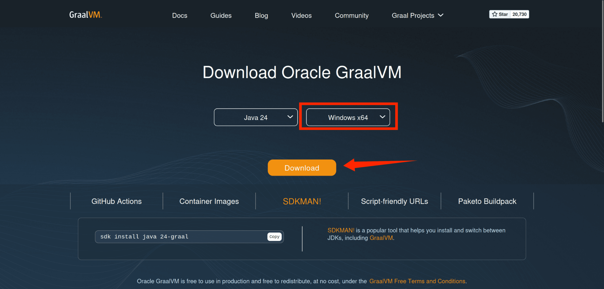

# Gradle 环境与 Java/Kotlin

> ***"万丈高楼平地起。"***

Mindustry是一个Java游戏项目，尽管其具备JavaScript mod接口，但是我们仍然更加建议使用性能更优，可维护性更强的java进行开发。

本篇教程也只会给出Java与Kotlin语言的演示程序与片段，如果你仍然决定使用JavaScript进行开发，可跳过本节阅读下一节：*“javaScript/typeScript开发环境”*。

> 我们会提供一个快速部署开发环境的脚本，但是你可能依然需要知道我们的快速脚本做了哪些事。

## 安装JDK（Java Development Kit）

配置Java开发环境最基本的一步就是安装JDK，JDK是Java开发的基础，它包含了Java编译器（javac）、Java运行时环境（JRE）等工具。

对于我们需要使用到的JDK版本，你可以在JDK 17及以上自由选择java版本，一般来说我们建议使用最新的长期支持版本（LTS），目前最新的LTS版本为JDK 21。

### 安装JDK

有多种JDK发行版可供选择，一般来说被广泛使用的有OracleJDK、Adoptium及GraalVM等。

以下为这些JDK的网页链接：

- [**OracleJDK**](https://www.oracle.com/java/technologies/javase-jdk21-downloads.html)
- [**Adoptium**](https://adoptium.net/)
- [**GraalVM**](https://www.graalvm.org/)

三类发行版的安装方式略有差异，但是OracleJDK的安装方式最为简单。

#### OracleJDK

OracleJDK的安装方式较为简单，它为Windows平台及Linux平台都提供了快速安装的发行包。

::: tip **Windows**
通过上述连接前往Oracle官网，一般来说Oracle只会提供最新的两个LTS版本和最新版本的下载链接，选择最新的LTS版本，点击下载链接，选择Windows x64 Installer（.exe）进行下载：


下载完成后，右键点击安装包，选择“以管理员身份运行”，你不需要做什么额外的设置，一路按照默认设置点击【下一步】直到安装完成即可。
:::

::: tip **Linux**
Oracle同样为Linux提供了`deb`和`rpm`软件包和，找到符合你系统架构的软件包，下载完成后打开终端，执行以下命令安装：

```bash
sudo dpkg -i 你下载的文件.deb
```

或者

```bash
sudo rpm -i 你下载的文件.rpm
```

:::

无论你通过哪一个方式安装完成JDK，在安装成功后均可通过以下命令检查JDK的安装情况：

```bash
java -version
```

如果你看到类似如下的输出，则说明JDK安装成功：

```
java version "21.0.6" 2025-01-21 LTS
Java(TM) SE Runtime Environment Oracle 21.0.6+8.1 (build 21.0.6+8-LTS-jvmci-23.1-b55)
Java HotSpot(TM) 64-Bit Server VM Oracle 21.0.6+8.1 (build 21.0.6+8-LTS-jvmci-23.1-b55, mixed mode, sharing)
```

如果你想要安装另外的两个JDK版本，请展开继续阅读：

::: details 另外两个JDK的安装方式

#### Adoptium

Adoptium是一个开源的JDK发行版，安装方式与OracleJDK类似，由社区从属的完全免费JDK，但事实上对于我们个人开发而言并不需要考虑版权和协议问题。

> [!NOTE] **Windows**
> Adoptium的安装方式与OracleJDK类似，前往Adoptium官网，选择最新的LTS版本，点击下载链接，选择Windows x64 JDK.msi进行下载：
> 
> 下载完成后，右键点击安装包，选择“以管理员身份运行”，与OracleJDK一样点击安装即可。

> [!NOTE] **Linux**
> 而Linux下安装Adoptium会相对比较麻烦，你需要下载它的`tar.gz`包，解压后手动配置路径及环境变量。
> 下载软件包，将其放到你希望将jdk安装到的位置，打开终端，执行以下命令：
> ```bash
> tar -xvf 你下载的文件.tar.gz
> cd 你解压的文件夹
> ls
> ```
> 你应当会得到如下输出：
> ```
> bin/  conf/  include/  jmods/  legal/  lib/  release  LINCESE.txt
> ```
> 我们需要的只有`bin`和`lib`这两个目录，要让java可以在命令行中使用，我们需要将`bin`目录添加到系统的环境变量中。
> ```bash
> echo 'export PATH=$PATH:你解压的文件夹/bin' >> ~/.bashrc
> source ~/.bashrc
> ```
> 如果你使用的是fish shell环境，可以直接使用`fish_add_path`来添加路径：
> ```fish
> fish_add_path 你解压的文件夹/bin
> ```
> 安装完成后仍然使用`java -version`命令检查JDK的安装情况。

#### GraalVM

GraalVM是一个应用AOT技术优化的高性能的JDK发行版，如果你希望获得更好的java程序运行效率，那么可以使用GraalVM进行开发。

GraalVM的安装方式较特殊，在Windows上反而较为麻烦，Linux上可以通过`pacman`进行快速安装。

> [!NOTE] **Windows**
> Windows上安装GraalVM需要下载它的`zip`包，解压后手动配置路径及环境变量。
> 进入GraalVM的下载页面，选择最新的LTS版本，选择Windows x64后点击下载按钮：
> 
> 下载完成后，将文件解压到你希望安装JDK的文件目录，将其中的`bin`目录添加到系统的环境变量中。
> ***windows待施工***

> [!NOTE] **Linux**
> Linux上安装GraalVM可以通过`pacman`进行快速安装，你可能需要先安装pacman，打开终端，执行以下命令：
> ```bash
> curl -s "https://get.sdkman.io" | bash
> ```
> 然后执行以下命令安装GraalVM：
> ```bash
> sdk install java 24-graal
> ```

:::