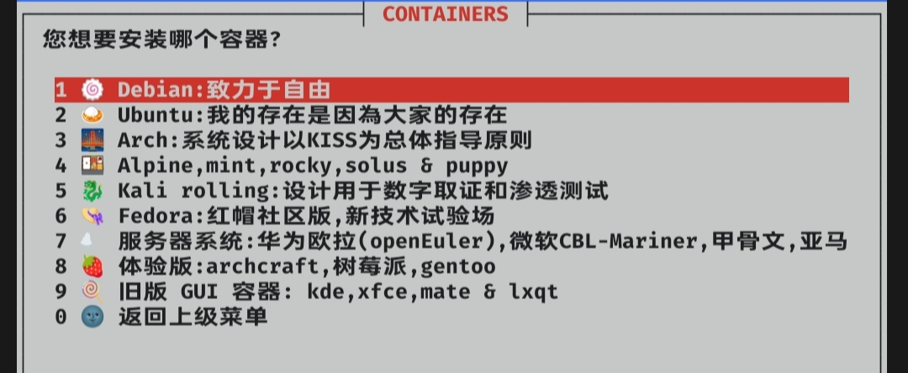

# 如果你只有Android设备
> [!IMPORTANT] 
> 本教程需要一定Linux基础

2025-03-17 Novarc

本教程将讲述在android手机上使用termux开发mdt mod的 基本配置 和 容器安装
由于部分设备不支持容器 也加入了如果不安装容器的一些配置方案(因为termux的路径系统 一些东西可能会有问题)

# Termux配置
> [!NOTE]
> Termux是一个**适用于 Android 的终端模拟器，其环境类似于 Linux 环境**。 无需Root或设置即可使用。 Termux 会自动进行最小安装 - 使用 APT 包管理器即可获得其他软件包。

> [!TIP]
> 推荐新人使用功能更加强大的**ZeroTermux**
> **ZeroTermux**基于**Termux**进行修改，内置一键切换apt/pkg软件源、一键备份恢复等多种便捷功能
> 另外支持背景

下面ZeroTermux和Termux二选一
:::: tabs

::: tab ZeroTermux
<GitHubCard repo="hanxinhao000/ZeroTermux"/>
[官方下载站](https://d.icdown.club/repository/main/ZeroTermux/)
[下载最新版](http://getzt.icdown.club/)
::: details 预览


:::

::: tab Termux
<GitHubCard repo="termux/termux-app"/>
[**从镜像下载**](https://github.tbedu.top/https://github.com/termux/termux-app/releases/download/v0.118.1/termux-app_v0.118.1+github-debug_arm64-v8a.apk)
:::

::::
## Termux基础介绍
- ~/
  - .termux/， Termux配置
   - termux.properties， termux基础配置
   - colors.properties， 配色配置
   - font.ttf， 字体 可以替换
   - shell
  - storage/， 挂载的外部储存卡
   - download/， /storage/emulated/0/Download/
   - documents/， /storage/emulated/0/Documents/
   - ...

挂载存储卡请运行`termux-setup-storage`
## 基础配置(可选)
### 小键配置
修改~/.termux/termux.properties
### 配色方案
修改~/.termux/colors.properties
### 字体设置
修改~/.termux/font.ttf
### ZeroTermux配置(可选)
打开左菜单 自行配置
### 镜像配置
**清华源**
::: code-group

```txt [ZeroTermux]
打开左菜单选择切换源
```

```shell [Termux图形界面]
termux-change-repo
```

```shell [Termux命令行]
sed -i 's@^\(deb.*stable main\)$@#\1\ndeb https://mirrors.tuna.tsinghua.edu.cn/termux/apt/termux-main stable main@' $PREFIX/etc/apt/sources.list
apt update && apt upgrade
```

:::
# 容器安装
部分国产安卓系统可能不支持容器
如果不想安装容器就跳过
安装容器后基本上就是相当于拥有了一个linux系统 配置模组开发环境和IDE可以参考前面的教程

对于没有toot的 推荐使用PRoot
>[!NOTE]
>PRoot 是一个 chroot, mount –bind, 和 binfmt_misc 的用户空间实现。这意味着，用户不需要任何特殊权限和设置就可以使用任意目录作为新的根文件系统或者通过QEMU运行为其它CPU架构构建的程序。

对于已root的 推荐使用chroot
>[!NOTE]
>Chroot 是一种修改当前进程及其子进程的可见根目录的操作。修改后，进程将不能访问该环境目录树以外的任何文件和命令，这种修改后的环境叫作 chroot jail（直译为 chroot 监狱）


> [!TIP]
> 由于直接使用proot/chroot安装比较麻烦 一些配置比较复杂 本教程使用Tmoe安装容器
## Tmoe
>[!NOTE]
>**TMOE** More Optional Environments.

<GitHubCard repo="2moe/tmoe"/>

[官方文档](https://doc.tmoe.me/)

安装
::: code-group

```txt [ZeroTermux]
打开左菜单选择`MOE全能`
```

```shell [Termux]
pkg install -y curl#安装curl
curl -LO https://gitee.com/mo2/linux/raw/2/2.awk
awk -f 2.awk
```

:::
后续使用`tmoe`或者`awk -f 2.awk`命名便可直接打开
### 容器
选择`proot/chroot容器`选择`arm64发行版列表`

> [!NOTE]
> Arch Linux 是一个轻量级和高度可定制的 Linux 发行版，最初发布于 2002 年。与其他流行的发行版不同，Arch Linux 是一个简约的发行版，采用自己动手（DIY）的方式。它是为中高级 Linux 用户设计的，他们喜欢控制和灵活性而不是易用性

> [!NOTE]
> Ubuntu 由 Canonical 创建，它是最受欢迎的 Linux 发行版之一，为所有用户和各种使用情况而设计。你可以将 Ubuntu 用于日常工作、开发环境、休闲浏览等方面。

> [!TIP]
> 似乎因为tmoe过老 arch安装过程似乎因为镜像问题速度有点慢了
自行选择 推荐ArchLinux或者Ubuntu

因为tmoe安装过程十分人性化
而且有中文 所以自己配置 记住认真选择
别没用的都安了
如果需要使用idea或者vsc(不算code-server)的请记得通过tmoe安装桌面并且安装vnc

### tmoe tools
在linux容器里运行tmoe选择tools即可进入tmoe tools辅助安装软件了

### 图形化界面和VNC
> [!NOTE]
> VNC (Virtual Network Console)是虚拟网络控制台的缩写。它 是一款优秀的远程控制工具软件，由著名的 AT&T 的欧洲研究实验室开发的

直接启动tmoe tools来安装
本教程不介绍其他自行安装的方法

### ZSH配置(可选)
打开TMOE Tools
找到ZSH
配色和主题自选
::: details 预览
预览为p10k

:::
### VNC客户端安装
本教程使用AVNC客户端

<GitHubCard repo="gujjwal00/avnc"/>
[镜像直链下载](https://github.tbedu.top/https://github.com/gujjwal00/avnc/releases/download/v2.8.0/AVNC-2.8.0.apk)

# 无容器配置
无容器环境下的一些配置与linux相似但又区别 其他教程中的Termux分组指的就是无容器环境下的配置方案
自行参考其他教程
## 使用tmoe配置zsh(可选)
尽管tmoe一般是来安装容器的
不过也可以通过tmoe安装zsh美化终端
按照上面方法安装/打开tmoe
选择 **configure zsh美化终端**
后面操作和linux中使用tmoe配置zsh一样
