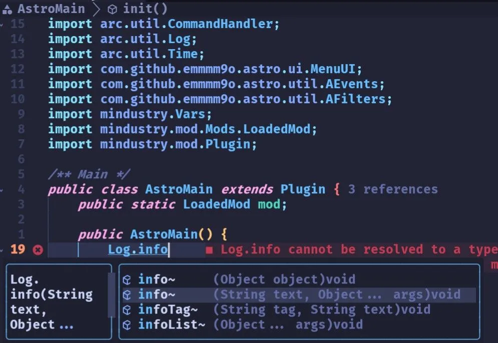

# Neovim

> [!IMPORTANT]
> 需要Lua基础和vim基础

2025-03-22 Novarc

<GitHubCard repo="neovim/neovim"/>

Neovim 是一款现代化、高效且功能丰富的编辑器，完全兼容 Vim。它支持插件、图形界面、语言服务器协议（LSP）、Lua 编程语言等功能。

::: details 预览
AstroNvim


:::

# 命令行安装
Nvim安装需要很多辅助的库\
git,gcc,ripgrep,fd,unzip,tree-sitter,luarocks
:::: tabs

::: tab "Windows" id="windows"
## 使用安装包
[stable版本位置](https://github.com/neovim/neovim/releases/tag/stable)
下面选择zip/msi安装
- zip [github下载地址](https://github.com/neovim/neovim/releases/download/stable/nvim-win64.zip)
自行解压
- msi [github下载地址](https://github.com/neovim/neovim/releases/download/stable/nvim-win64.msi)
自行运行

## 从包管理工具安装
关于包管理工具请看前面教程\
环境安装
### 使用Scoop
```shell
scoop install git gcc ripgrep fd unzip tree-sitter luarocks
```
```shell
scoop install neovim
```
> [!NOTE]
> **自行添加进环境变量**
:::

::: tab "Debian/Ubuntu" id="debian"
```shell
sudo apt install neovim
```
:::

::: tab "Arch Linux" id="arch"
```shell
sudo pacman -S neovim
```
:::

::: tab "Termux" id="termux"
```shell
pkg install neovim
```
:::

::::


> [!TIP]
> 长期在图形化界面使用**neovim**非常非常推荐安装**GUI客户端**\
> Termux无容器不支持GUI!\
> 安卓上运行的Linux也不建议使用**GUI**

# GUI安装
有非常多Neovim GUI客户端\
下面给出一些
## nvim-qt
<GitHubCard repo="equalsraf/neovim-qt"/>

:::: tabs

::: tab "Windows" id="windows"
> [!TIP]
> 在Neovim 0.10.0开始 Neovim Qt不在和neovim捆绑在一起\
> 在0.10.0之前 Neovim Qt包含在Neovim包里面

## 使用安装包
[最新版Release](https://github.com/equalsraf/neovim-qt/releases/latest)
- [zip github 下载v0.2.19](https://github.com/equalsraf/neovim-qt/releases/download/v0.2.19/neovim-qt.zip)
- [msi github 下载v0.2.19](https://github.com/equalsraf/neovim-qt/releases/download/v0.2.19/neovim-qt-installer.msi)
> [!NOTE]
> **自行添加进环境变量**
## 从包管理工具安装
```shell
scoop install neovim-qt
```
:::

::: tab "Debian/Ubuntu" id="debian"
```shell
sudo apt install neovim-qt
```
:::

::: tab "Arch Linux" id="arch"
```shell
sudo pacman -S neovim-qt
```
:::

::: tab "Termux" id="termux"
无容器Termux无GUI不支持
:::

::::

## neovide
> [!NOTE]
> neovide需要neovim `0.10`及以上

<GitHubCard repo="neovide/neovide"/>
:::: tabs

::: tab "Windows" id="windows"
## 使用安装包
[最新版Release](https://github.com/neovide/neovide/releases/latest)
- [zip github 下载v0.14.1](https://github.com/neovide/neovide/releases/download/0.14.1/neovide.exe.zip)
- [msi github 下载v0.14.1](https://github.com/neovide/neovide/releases/download/0.14.1/neovide.msi)
> [!NOTE]
> **自行添加进环境变量**
## 从包管理工具安装
```shell
scoop install neovide
```
:::

::: tab "Debian/Ubuntu" id="debian"
[最新版Release](https://github.com/neovide/neovide/releases/latest)\
[x86 linux版github下载v0.14.1](https://github.com/neovide/neovide/releases/download/0.14.1/neovide-linux-x86_64.tar.gz)\
貌似没有arm64的 需要自行构建
:::

::: tab "Arch Linux" id="arch"
```shell
sudo pacman -S neovide
```
如果需要在X11下运行 还需要`libxkbcommon-x11`
```shell
sudo pacman -S libxkbcommon-x11
```
:::

::: tab "Termux" id="termux"
无容器Termux无GUI不支持
:::

::::

# 配置
Neovim配置比较复杂\
下面有一些常用的第三方配置
- [AstroNvim](./4-1-astro-nvim.md)

# 镜像配置
讲一些neovim常用管理插件通用的镜像配置\
下面的`require().setup`有时候并不会直接出现
自行寻找哪里配置配置选项
## Lazy.nvim
Lazy.nvim安装插件从github.com安装\
在Lazy.nvim的setup文件(比如`lazy_setup.lua`)里面
```lua{5}
require("lazy").setup({
...
},{
...
  git = { url_format = "{镜像}/https://github.com/%s.git" },
-- 比如"https://github.tbedu.top/https://github.com/%s.git"
...
})
```
另外Lazy本身安装时候的镜像配置\
找到`init.lua`将里面的`https://github.com`前面加上镜像就好了

## Mason
Mason安装部分包时候默认从github.com安装\
找到Mason setup的位置\
部分集成化配置(比如AstroNvim在`~/.local/share/nvim/lazy/AstroNvim/lua/astronvim/plugins/mason.lua`里面)自行寻找
```lua{3}
require("mason").setup({
  ...
  github = {download_url_template = "{镜像}/https://github.com/%s/releases/download/%s/%s",},
-- 比如"https://github.tbedu.top/https://github.com/%s/releases/download/%s/%s"
  ...
})
```
