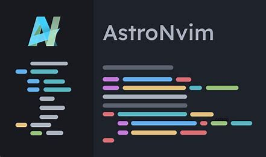

# AstroNvim
> [!IMPORTANT]
> 需要Lua基础和vim基础

2025-03-22 Novarc

<GitHubCard repo="AstroNvim/AstroNvim"/>


::: details 预览

:::
**AstroNvim** 是一个美观且功能丰富的 **Neovim** 配置方案，注重可扩展性和可用性。
[官方文档](https://docs.astronvim.com/)

[Neovim安装](./4-0-neovim.md)

## 需求
- [Nerd Fonts](https://www.nerdfonts.com/font-downloads) 含有图标的字体
- **Neovim** v0.9.5+ (不含nightly版)
- 粘贴板管理器 (Linux用户)
- 支持真彩色的终端
- 可选
  - [ripgrep](https://github.com/BurntSushi/ripgrep) - 实时全局搜索（通过 Telescope 插件，快捷键 `<Leader>fw`）
  - [lazygit](https://github.com/jesseduffield/lazygit) - Git 终端可视化界面（快捷键 `<Leader>tl` 或 `<Leader>gg` 切换终端）
  - [gdu](https://github.com/dundee/gdu) - 磁盘用量分析工具（快捷键 `<Leader>tu` 切换终端）
  - [bottom](https://github.com/ClementTsang/bottom) - 进程监控器（快捷键 `<Leader>tt` 切换终端）
  - [Python](https://www.python.org/) - Python 交互式终端（快捷键 `<Leader>tp` 切换）
  - [Node.js](https://nodejs.org/) - 为多数 LSP 提供支持，同时开启 Node 交互式终端（快捷键 `<Leader>tn` 切换）

## 安装
使用[官方模板](https://github.com/AstroNvim/template)
:::: tabs

::: tab "Windows" id="windows"
备份 原有配置(可选)
```shell
Move-Item $env:LOCALAPPDATA\nvim $env:LOCALAPPDATA\nvim.bak
```
进一步备份 (可选)
```shell
Move-Item $env:LOCALAPPDATA\nvim-data $env:LOCALAPPDATA\nvim-data.bak
```
安装
```shell
git clone --depth 1 https://github.com/AstroNvim/template $env:LOCALAPPDATA\nvim
Remove-Item $env:LOCALAPPDATA\nvim\.git -Recurse -Force
nvim #等待安装
```
:::

::: tab "Debian/Ubuntu" id="debian"
备份 原有配置(可选)
```shell
mv ~/.config/nvim ~/.config/nvim.bak
```
进一步备份 (可选)
```shell
mv ~/.local/share/nvim ~/.local/share/nvim.bak
mv ~/.local/state/nvim ~/.local/state/nvim.bak
mv ~/.cache/nvim ~/.cache/nvim.bak
```
安装
```shell
git clone --depth 1 https://github.com/AstroNvim/template ~/.config/nvim
rm -rf ~/.config/nvim/.git
nvim #等待安装
```
:::

::: tab "Arch Linux" id="arch"
备份 原有配置(可选)
```shell
mv ~/.config/nvim ~/.config/nvim.bak
```
进一步备份 (可选)
```shell
mv ~/.local/share/nvim ~/.local/share/nvim.bak
mv ~/.local/state/nvim ~/.local/state/nvim.bak
mv ~/.cache/nvim ~/.cache/nvim.bak
```
安装
```shell
git clone --depth 1 https://github.com/AstroNvim/template ~/.config/nvim
rm -rf ~/.config/nvim/.git
nvim #等待安装
```

:::

::: tab "Termux" id="termux"
备份 原有配置(可选)
```shell
mv ~/.config/nvim ~/.config/nvim.bak
```
进一步备份 (可选)
```shell
mv ~/.local/share/nvim ~/.local/share/nvim.bak
mv ~/.local/state/nvim ~/.local/state/nvim.bak
mv ~/.cache/nvim ~/.cache/nvim.bak
```
安装
```shell
git clone --depth 1 https://github.com/AstroNvim/template ~/.config/nvim
rm -rf ~/.config/nvim/.git
nvim #等待安装
```

:::

::::
安装好后将`~/.config/nvim/lua/plugins/`下的每个文件首行
```lua
if true then return {} end -- WARN: REMOVE THIS LINE TO ACTIVATE THIS FILE
```
去掉激活文件
## 特征
- 通过 [AstroCommunity](https://github.com/AstroNvim/astrocommunity) 实现通用插件规范  
- 使用 [Heirline](https://github.com/rebelot/heirline.nvim) 定制状态栏、窗口标题栏和标签栏  
- 基于 [lazy.nvim](https://github.com/folke/lazy.nvim) 的插件管理  
- 通过 [mason.nvim](https://github.com/williamboman/mason.nvim) 管理语言工具包  
- [Neo-tree](https://github.com/nvim-neo-tree/neo-tree.nvim) 提供文件树导航  
- [Cmp](https://github.com/hrsh7th/nvim-cmp) 实现智能代码补全  
- [Gitsigns](https://github.com/lewis6991/gitsigns.nvim) 集成 Git 差异标记  
- [Toggleterm](https://github.com/akinsho/toggleterm.nvim) 支持可切换终端  
- 通过 [Telescope](https://github.com/nvim-telescope/telescope.nvim) 进行模糊搜索  
- [Treesitter](https://github.com/nvim-treesitter/nvim-treesitter) 增强语法高亮  
- 借助 [none-ls](https://github.com/nvimtools/none-ls.nvim) 实现代码格式化与静态检查  
- [Native LSP](https://github.com/neovim/nvim-lspconfig) 提供语言服务器协议支持  

## 配置 

要开始自定义配置，您只需**将自己的 `nvim` 文件夹视为专属 Neovim 配置**！您还可以将其同步到 Git 仓库进行备份。AstroNvim 本质上是一个由 [Lazy](https://github.com/folke/lazy.nvim) 包管理器管理的插件，它提供了一系列预置插件及其配置。

### 启动模板
如果你使用的是上面的安装方式\
会得到下面的文件树

- ~/.config/nvim/
  - README.md
  - init.lua 安装Lazy.nvim插件管理器 在这里修改lazy安装镜像
  - lua/
    - community.lua 导入AstroCommunity插件
    - lazy_setup.lua 配置并启动lazy.nvim 这里修改Lazy安装其他插件时用镜像
    - plugins/ 配置插件
      - astrocore.lua
      - astrolsp.lua
      - astroui.lua
      - mason.lua
      - none-ls.lua
      - treesitter.lua
      - user.lua
      - ... 
    - polish.lua 最后执行Lua

## 核心配置解析

### 顶层文件 `init.lua`
- **核心作用**：作为配置入口文件
- **执行流程**：
  1. 自动检测并安装 [`lazy.nvim`](https://github.com/folke/lazy.nvim) 插件管理器（若未安装）
  2. 调用 `lua/lazy_setup.lua` 完成 AstroNvim 核心插件与用户插件的协同加载
  3. 通过模块化设计实现配置分层管理

### `plugins/` 插件目录结构
- **核心配置**：前三个插件文件用于 AstroNvim 基础配置（如 `astronvim.lua`）
- **增强配置**：后续四个文件用于扩展内置插件功能（如 `treesitter.lua` 优化语法解析）
- **用户自定义**：默认通过 `user.lua` 集中管理插件，支持按需拆分为独立文件（推荐按插件名命名文件）

### AstroCommunity 
```lua title="lua/community.lua"
return {
  -- 添加社区插件规范仓库
  "AstroNvim/astrocommunity",
  --插件可以在https://github.com/AstroNvim/astrocommunity找到
  --下面推荐一些常用插件
  { import = "astrocommunity.pack.lua" },
  -- Lua环境
  { import = "astrocommunity.editing-support.neogen" },
  -- 注解生成
  { import = "astrocommunity.bars-and-lines.lualine-nvim" },
  { import = "astrocommunity.bars-and-lines.bufferline-nvim" },
  --更好的底部状态条
  { import = "astrocommunity.colorscheme.tokyonight-nvim" },
  -- tokyonight主题 Preview使用的
  { import = "astrocommunity.color.transparent-nvim" },
  -- 背景透明 :TransparentToggle激活
}
```
## Java Lsp配置
使用Neovim开发Java Mod使用\
`eclipse-jdtls`作为Java的LSP

<GitHubCard repo="eclipse-jdtls/eclipse.jdt.ls"/>

> [!IMPORTANT]
> 较新版本的Jdtls不支持java 17\
> 实测1.39.0版本可以运行\
> arch linux如果想用pacman安装jdtls要学会降版本

### 通过Mason安装jdtls
运行`:MasonInstall jdtls`即可

### 本地安装
下载[https://download.eclipse.org/justj/?file=jdtls/milestones/1.39.0](https://download.eclipse.org/justj/?file=jdtls/milestones/1.39.0)里面的对应文件\
自行解压 配置环境变量\
运行`mkdir ~/.local/share/nvim/mason/packages/jdtls`诱骗Mason认为jdtls已经安装

## 无容器Termux特别注意
> [!IMPORTANT] 
> jdtls安装好后 因为Termux的路径系统问题需要调整

```shell
vim ~/.local/share/nvim/lazy/nvim-lspconfig/lua/lspconfig/configs/jdtls.lua
```
修改文件
```lua{6}
...
  return {
    default_config = {
        cmd = {
            'python3',
            '{到jdtls的绝对路径}',
            '-configuration',--这行没变
            ...
          }
      }
}
...
```
