## 纹理与点阵图（Pixmap）

在先前章节的学习中，我们已经成功在屏幕上画出了一个三角形，但是我们需要的往往是更加复杂的图案与形状，而不仅仅是简单的几何图形。

这就需要向GL传递图像数据，利用图像来绘制复杂的图案。

### 纹理

**纹理（Texture）** 是OpenGL对图像数据的一种抽象，它可以从文件加载，也可以由GL生成。

创建或者加载一个纹理在GL的工作流在Arc中纹理被封装为了一个java类型`arc.graphic.Texture`。要创建一个纹理，只需要调用`Texture`的多个构造函数之一：

```java
void example(){
  Texture tex1 = new Texture(new Fi("..."));  // 从文件加载纹理
  Texture tex2 = new Texture(pixmap);         // 从Pixmap创建纹理
  Texture tex3 = new Texture(
      new Fi("..."),
      true//useMipmaps
  );  // 从文件加载纹理并启用mipmap
  
  Texture tex4 = new Texture(textureData);    // 从纹理数据创建纹理
}
```

其中出现的**pixmap**在本节的后面会介绍，而**textureData**是一个纹理模型，具体来说这是接口`arc.graphic.TextureData`的实例。

`TextureData`对象则存储了纹理的图像数据，包括图像内容，图像的宽高，以及图像的颜色格式，对于不同类型的Texture会具有不同类型的`TextureData`。

我们上面给出的实例化范例除指定纹理数据的方式以外，通过文件创建的纹理数据对象为`arc.graphic.gl.FileTextureData`，它表示这个纹理的信息来自图像文件。

而从Pixmap创建纹理的数据对象则为`arc.graphic.gl.PixmapTextureData`，它表示这个纹理的信息被存储在一张在内存上的**点阵图**中。

以下是Arc内置的纹理数据类型：

- `arc.graphic.gl.FileTextureData` 来自文件的纹理数据
- `arc.graphic.gl.PixmapTextureData` 图像存储在`Pixmap`上的内存纹理数据
- `arc.graphic.gl.FloatTextureData` 图像存储在`FloatBuffer`上的内存纹理数据
- `arc.graphic.gl.GLOnlyTextureData` 在GL内部生成的纹理数据，图像数据被存储在GPU显存内
- `arc.graphic.gl.MipMapTextureData` 特殊的纹理数据，用于存储多个mipmap级别的其他纹理数据

而多数情况下我们只需要使用`Texture`本身的构造器就足够了，各类纹理数据对象往往会在需要使用的地方已经由工具进行创建，很少会需要从手动创建的纹理数据中构造纹理对象。

例如，我们用这样一张图片去创建一个纹理（是的，这是我头像）：

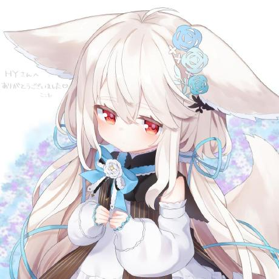

把这张图片保存为文件`texture.png`，然后放入到mod目录下的任意子目录中（不要放在sprites目录下，之后的章节我会解释为什么），例如，我们将这个图片放到mod的根目录下，然后我们可以这样去手动加载这个纹理：

```java
void example(){
  Fi modRoot = Vars.mods.getMod("example-mod").root;
  Texture tex = new Texture(modRoot.child("texture.png"));
}
```

`Vars.mods.getMod`可以获取具有给定内部名称的模组元属性对象，`root`为这个mod的根目录路径。这里我们就已经对这个图像创建了它的纹理对象，接下来我们就可以在着色器中使用这个纹理了。

### 采样器

在我们创建好纹理对象之后，就需要将它提供给片段着色器用于给片段染色了。

在着色器中，会使用**采样器（Sampler）** 来表示一个纹理对象，它可以通过特定的采样函数来从纹理内读取颜色。

采样器在glsl中由`uniform`定义的对应纹理类型的`sampler`变量接收：

```glsl
uniform sampler2D u_texture;
uniform sampler3D u_block;
uniform samplerCube u_cubemap;
```

此处我们先只讨论最常用的2D纹理`sampler2D`，采样器可以通过采样函数`texture2D()`从纹理中读取指定位置的颜色，例如我们编写这样一个片段着色器：

```glsl
uniform sampler2D u_texture;

varying vec2 v_texCoord;

void main() {
    gl_FragColor = texture2D(u_texture, v_texCoord);
}
```

在上一章中没有用上的那个`v_texCoord`在这里派上了用场！它表示的是在纹理上进行采样的**纹理空间坐标（Texture Space Coordinates）**，通常记作`u`和`v`，顶点上记录它们在纹理上进行采样的位置，通过varying插值后传递给片段着色器即可简单的实现将片段关联到纹理空间坐标。

纹理空间坐标**uv**是**归一化**的，纹理坐标也被缩放到了0到1之间，以图像的左下角为原点（0, 0），右上角为（1, 1）。

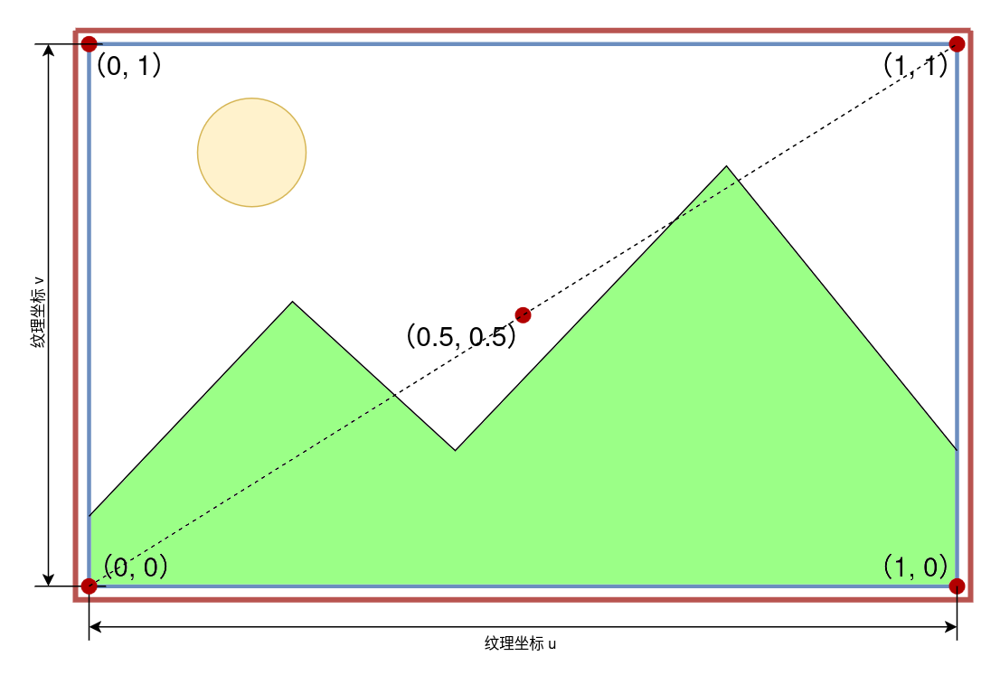

现在，我们为片段着色器补充顶点着色器，并构造一个四边形的`Mesh`，用与上一章相同的方法将这个图像绘制到屏幕上：

`顶点着色器`
```glsl
attribute vec2 a_position;
attribute vec2 a_texCoord0;

varying vec2 v_texCoord;

void main() {
    v_texCoord = a_texCoord0;
    gl_Position = vec4(a_position, 0.0, 1.0);
}
```

`片段着色器`
```glsl
uniform sampler2D u_texture;

varying vec2 v_texCoord;

void main() {
    gl_FragColor = texture2D(u_texture, v_texCoord);
}
```

```java
class Example{
  Mesh mesh = new Mesh(true, 4, 6,
      VertexAttribute.position,
      VertexAttribute.texCoords
  );
  Texture tex = new Texture(
      Vars.mods.getMod("example-mod").root.child("texture.png")
  );
  Shader shader = new Shader(vertexShaderFi, fragmentShaderFi);

  {
    mesh.setVertices(new float[]{
       //顶点坐标       纹理坐标
        -0.5f, -0.5f,  0f, 0f,
         0.5f, -0.5f,  1f, 0f,
         0.5f,  0.5f,  1f, 1f,
        -0.5f,  0.5f,  0f, 1f,
    });
    mesh.setIndices(new short[]{
        0, 1, 2, //第一个三角形
        0, 2, 3  //第二个三角形
    });
  }
  
  void draw(){
    shader.bind();
    tex.bind();   // 绑定纹理
    mesh.render(shader, Gl.triangles);
  }
}
```

不出意外你将会得到一张上下颠倒的渲染图像：

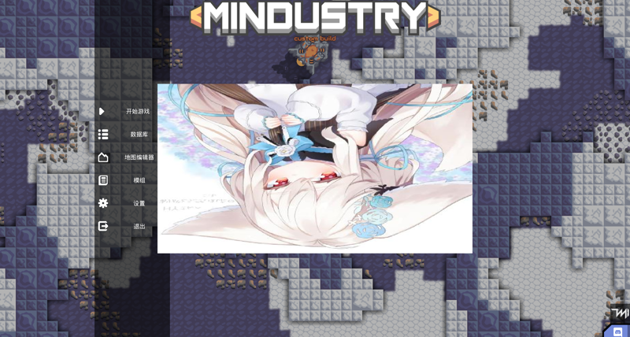

图像会被颠倒是因为计算机上存储图像时，往往是从左上角开始为（0, 0），至图像的右下角为（1，1）。OpenGL并不关注图像的存储方式，当文件被加载到OpenGL纹理后，它始终认为纹理坐标的原点为左下角，因此直接使用OpenGL的纹理坐标采样会使得图像被颠倒。


要解决这个问题也很简单，只需要将纹理坐标的v值取反即可，修改顶点坐标如下：

```java
void example(){
  //...
  mesh.setVertices(new float[]{
     //顶点坐标       纹理坐标
      -0.5f, -0.5f,  0f, 1f,
       0.5f, -0.5f,  1f, 1f,
       0.5f,  0.5f,  1f, 0f,
      -0.5f,  0.5f,  0f, 0f,
  });
  //...
}
```

这样就可以得到正确的渲染图像了：


> 特意强调图像的翻转问题并非多此一举，因为纹理坐标的翻转在后续的纹理区域上被记录，其`v`正是翻转过后的。

### 纹理环绕

前面我们说到，纹理空间的坐标是被缩放到了0-1之间的，这就有可能会存在超出范围外的数据，此时就需要对超出范围外的采样操作进行一些处理，这个操作即**纹理环绕（Texture Warp）**。

对于超出范围外的采样操作，OpenGL提供了三种环绕模式来决定如何处理越界的采样：

- `GL.clampToEdge`：超出范围外的采样点会被截断到纹理边缘的颜色
- `GL.repeat`：超出范围外的采样点会被重复采样
- `GL.mirroredRepeat`：超出范围外的采样点会被镜像采样

而Arc将这三种环绕模式封装成了枚举类`Texture.TextureWrap`，而默认情况下纹理的环绕方式为`GL.clampToEdge`。

我们可以通过`setWrap`方法来设置纹理的环绕模式：

```java
void example(Texture tex) {
  tex.setWrap(Texture.TextureWrap.clampToEdge);
  tex.setWrap(Texture.TextureWrap.repeat);
  tex.setWrap(Texture.TextureWrap.mirroredRepeat);
}
```

三种环绕方式的实际效果：

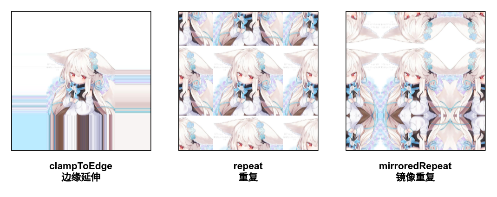

我们也可以对纹理的`u`和`v`分别设置不同的环绕方式：

```java
void example(Texture tex) {
  tex.setWrap(
      Texture.TextureWrap.clampToEdge, // u warp
      Texture.TextureWrap.repeat       // v warp
  );
}
```

环绕方式在我们渲染拼贴画或者一些有趣的拼接式图案时会很有用。

### 纹理过滤

OpenGL纹理是归根结底还是**点阵图**，即一个个有颜色的像素组成的图案，当我们使用采样器对图像进行采样时，采样坐标的精细度与图像的精细度往往不匹配。

这个时候就需要对采样点进行一系列调整与处理来采样出符合预期的图像。而这个操作就是**纹理过滤（Texture Filter）**。

OpenGL也提供了两种基本的纹理过滤方式：

- `GL.nearest`：最近邻过滤，即采样点会取离采样坐标最近的像素颜色
- `GL.linear`：线性过滤，即采样点会取离采样坐标最近的四个像素颜色，然后根据距离对它们进行插值混合

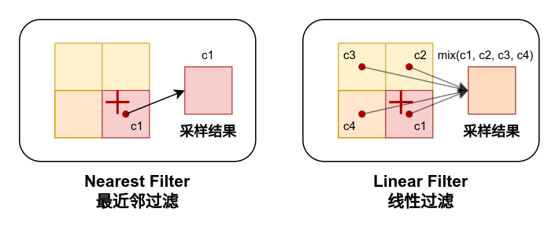

与纹理环绕一样，Arc也提供了枚举类`Texture.TextureFilter`来封装这两种纹理过滤方式，默认情况下纹理的过滤方式为`GL.linear`。

就像设置环绕方式一样，我们也可以通过`setFilter`方法来设置纹理的过滤方式：

```java
void example(Texture tex) {
  tex.setFilter(Texture.TextureFilter.nearest);
  tex.setFilter(Texture.TextureFilter.linear);  
}
```

两种纹理过滤方式会使得采样出来的图像有所差异，`nearest`过滤方式会使得图像的边缘更加锐利，同时会突出边缘的锯齿；而`linear`过滤方式则会使得图像更加平滑，但是会使得图像的边缘模糊，同时会增大采样的开销。

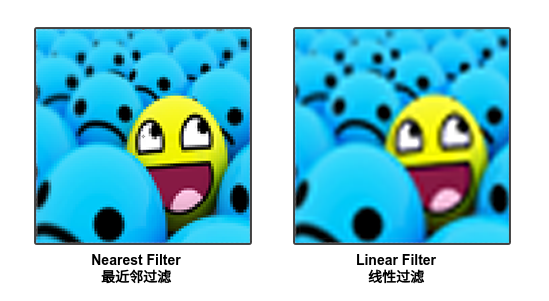

###### （容我从LearnOpenGL搬张图，整这个挺麻烦的）

同时，还可以对纹理的放大采样（Magnify）和缩小采样（Minify）分别设置不同的过滤方式：

```java
void example(Texture tex) {
  tex.setFilter(
      Texture.TextureFilter.nearest, // minify filter
      Texture.TextureFilter.linear   // magnify filter
  );
}
```

### 多级细节纹理（Mipmap）

考虑到缩放与距离，有时候在绘图中一个图像在绘制时其实会被缩放的非常小，此时它将产生不了多少个片段，继续在高分辨率的原始图像上采样很难再取得一个正确的颜色值。

事实上Mindustry中已经出现了很严重的条纹现象，这正是未开启Mipmap所导致的，但是Mipmap在mindustry的主渲染流程中事实上无法被使用，之后我也会解释为什么。

为了解决高分辨率纹理采样错误的问题，OpenGL提供了**多级细节纹理（Mipmap）** 机制，它会在纹理的分辨率上生成一系列的缩略图，当纹理被缩放时，OpenGL会根据缩放比例选择最合适的缩略图进行采样。

我们不需要去手动绘制这些缩略图，在构造Texture时，通过给构造函数的`mipmap`参数传入true，纹理将会自动为我们创建Mipmap纹理链。

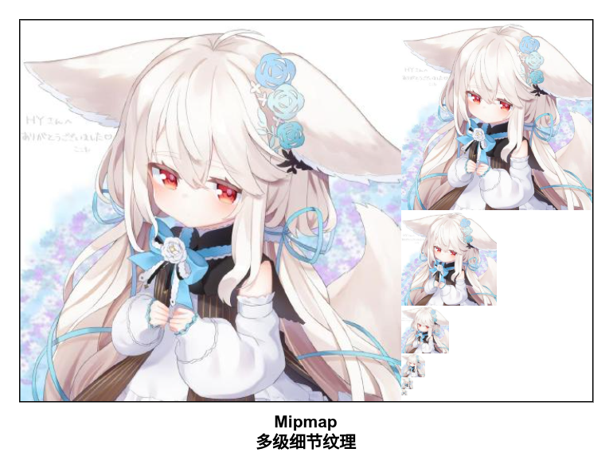

而对于多级细节的纹理，它的采样方式是另外四种用于多级细节纹理的过滤方式：

- `GL.nearestMipMapNearest` 从最接近的mipmap级别中进行采样，并使用最近邻过滤
- `GL.linearMipMapNearest` 从最接近的mipmap级别中进行采样，并使用线性过滤
- `GL.nearestMipMapLinear` 从两个最接近的mipmap级别中进行最近邻采样，并使用最近邻过滤
- `GL.linearMipMapLinear` 从两个最接近的mipmap级别中进行线性插值采样，并对采样的两个颜色进行线性插值

这些同样也被封装在了枚举类`Texture.TextureFilter`中，默认情况下多级细节纹理的过滤方式为`GL.linearMipMapLinear`。

```java
void example(Texture tex) {
  tex.setFilter(Texture.TextureFilter.nearestMipMapNearest);
  tex.setFilter(Texture.TextureFilter.linearMipMapNearest);
  tex.setFilter(Texture.TextureFilter.nearestMipMapLinear);
  tex.setFilter(Texture.TextureFilter.linearMipMapLinear);
}
```

### 纹理单元

在我们之前的教程中，绘制纹理对象时似乎直接将其绑定后，直接就能够从着色器的uniform中进行采样了，但是事实上纹理的装载是有一个模型的，它就是**纹理单元（Texture Unit）**。

我们之所以能直接绑定纹理然后直接在着色器内获得采样器，原因在于OpenGL默认情况下会激活`0`号纹理单元，并在着色器中只有唯一的一个`uniform`采样器时，将这个采样器绑定到`0`号纹理单元上。

当我们绑定纹理时，实际上是将纹理绑定到了当前正在活动的纹理单元上，在着色器运行时则通过纹理单元来定位图像，并将它们提供给着色器的`uniform`采样器。

ArcGL最多支持32个纹理单元，这对我们来说已经完全够用了。绑定和激活纹理单元的工作在`Texture`中也已经封装了，我们只需要在绑定纹理时传入一个纹理单元索引即可。

```java
void example() {
  tex0.bind(0);
  tex1.bind(1);
  tex2.bind(2);
  //...
  tex31.bind(31);
  //tex32.bind(32); 不要这么做，超出范围了！

  Gl.activeTexture(Gl.texture0); // 重设活动的纹理单元为0
}
```

在你将纹理绑定到一个非0号的纹理单元后，当前活动的纹理单元不会自动重设为0，而游戏内最普遍使用的是默认的`bind()`方法进行纹理绑定，因此你应该在完成多个纹理的绑定后，将当前活动的纹理单元重设为0，否则后续的绘图纹理会被放入错误的纹理单元从而造成问题。

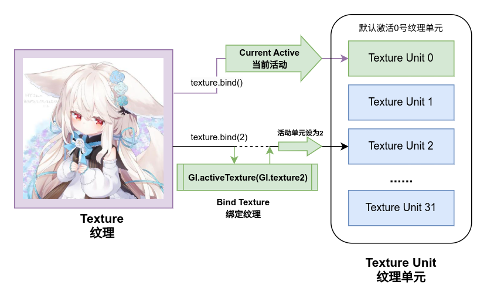

>你也可以尝试一下不重设纹理单元，看看会发生什么。

既然在着色器中采样器是通过`uniform`传入的，那么就应该为这个变量设置值。

默认情况下，当着色器中只有一个`uniform sampler`采样器变量时，它会自动从`0`纹理单元中获取纹理，但是当我们需要传入多个纹理时，则需要为`uniform`设置索引值：

```java
void example(Shader shader) {
  shader.bind();
  shader.setUniformi("u_texture0", 0);
  shader.setUniformi("u_texture1", 1);
  shader.setUniformi("u_texture2", 2);
  //...
}
```

在`sampler`类的uniform变量上设置的整数值，表示的是这个采样器将从哪个纹理单元中读取纹理数据，同样的，数值只有在`0-31`之间时才能正常工作。

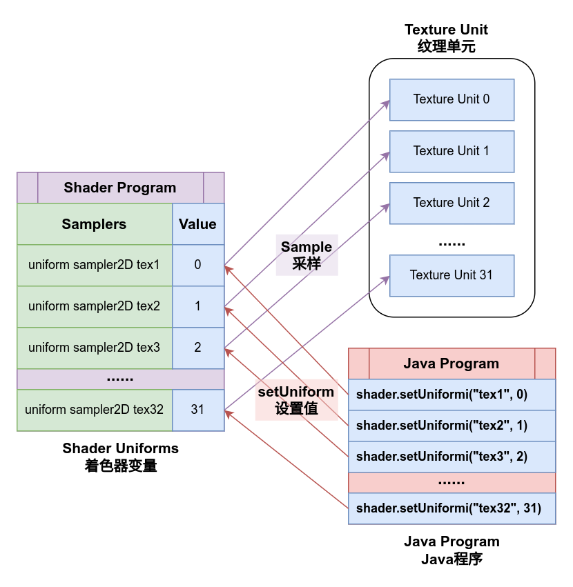

我们现在可以试试传入两个图像，并将它们混合显示，我们这样修改前文范例中的片段着色器：

```glsl
uniform sampler2D u_texture0;
uniform sampler2D u_texture1;

varying vec2 v_texCoord;

void main() {
    vec4 c1 = texture2D(u_texture0, v_texCoord);
    vec4 c2 = texture2D(u_texture1, v_texCoord);
    
    gl_FragColor = c1 * c2;
}
```

我们把这张图片放入到模组资源根目录，然后将他命名为`texture1.png`：

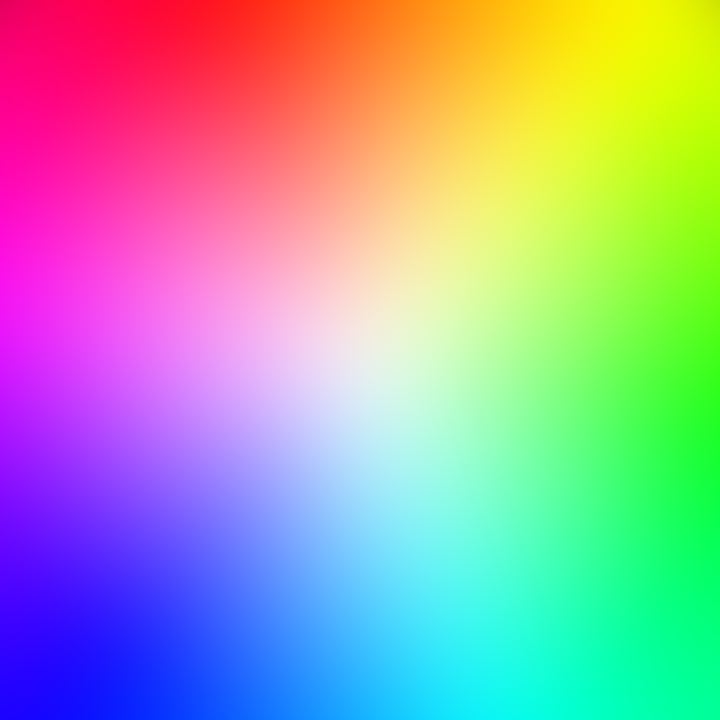

接着修改主程序获取两个纹理，并分别将它们传递给着色器：

```java
class Example{
  // ...
  
  Texture tex1 = new Texture(
      Vars.mods.getMod("example-mod").root.child("texture.png")
  );
  Texture tex2 = new Texture(
      Vars.mods.getMod("example-mod").root.child("texture1.png")
  );
  
  void draw(){
    shader.bind();
    tex1.bind(0);
    shader.setUniformi("u_texture0", 0);
    tex2.bind(1);
    shader.setUniformi("u_texture1", 1);
    Gl.activeTexture(Gl.texture0);
    
    mesh.render(shader, Gl.triangles);
  }
}
```

运行它, 看看结果：

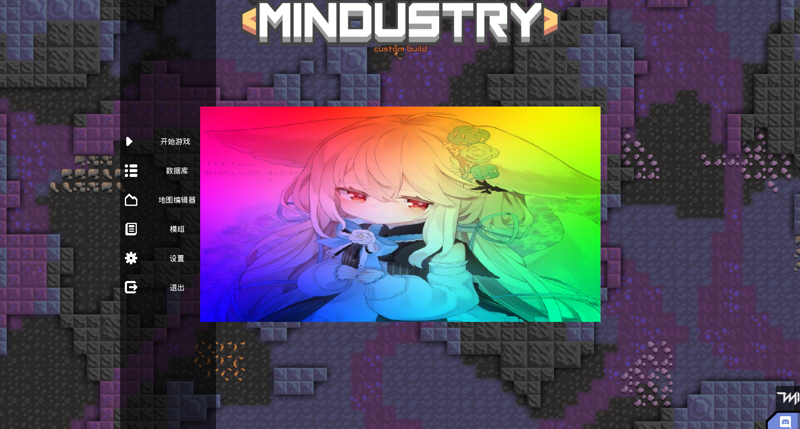

### 点阵图（Pixmap）

**点阵图（Pixmap）** 是一块**可写的**在内存上的对一块图像的抽象，一个点阵图对象会包含图像的长宽等元数据以及图像完整的像素数据。

点阵图的程序类型为`arc.graphic.Pixmap`，它有构造器可以从文件或者字节序列创建点阵图，或者通过图像的长宽等基础数据创建一块空白的画布。

```java
Pixmap pixmap = new Pixmap(128, 128);             // 创建一块128x128的空白画布
Pixmap pixmap = new Pixmap(new Fi("..."));        // 从文件创建点阵图
Pixmap pixmap = new Pixmap(byteArray);            // 从字节序列创建点阵图
Pixmap pixmap = new Pixmap(byteBuffer, 128, 128); // 从字节序列创建点阵图
```

`Pixmap`内部提供了一系列实用方法，用于向点阵图内绘制形状，文本与图像等，或者从点阵图中读取颜色信息，翻转画布等。

譬如我们可以使用纯代码的形式在一个空白画布上画下一个三角形：

```java
void example(){
  Pixmap pixmap = new Pixmap(128, 128);
  pixmap.fill(Color.white);
  
  pixmap.drawLine(0, 0, 64, 128, Color.black.rgba());
  pixmap.drawLine(64, 128, 128, 0, Color.black.rgba());
  pixmap.drawLine(0, 0, 128, 0, Color.black.rgba());
}
```

没错，你又得到了一个倒过来的三角形，因为文件的坐标系与点阵图的程序坐标系y轴方向是相反的！

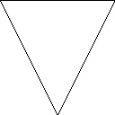

你可以通过`Pixmap`的`flipY()`方法来创建一个翻转过来的图像拷贝。

```
Pixmap flipped = pixmap.flipY();
```

结果：

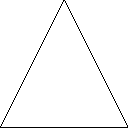

前面我们有提及过，从点阵图可以创建纹理对象，同样的，我们也可以反过来从纹理对象中提取它的点阵图，然后去对它进行读取颜色，绘图，翻转等操作：

```java
void example(Texture tex){
  Pixmap pixmap = tex.getTextureData().getPixmap();
  Color c = new Color(pixmap.get(10, 10));
  pixmap.set(20, 20, c.rgba());
  Pixmap xFlipped = pixmap.flipX();
  Pixmap yFlipped = pixmap.flipY();
  //...
}
```

但是有一类特殊的纹理数据`GlOnlyTextureData`，这类纹理的数据并不在内存上，而是映射自GPU上的显存，因此无法直接通过纹理数据来提取它的点阵图。

### 小练习

如果我们需要让一张图像以屏幕中轴镜像，在中轴左右两侧绘制两次，有多少种办法可以实现呢？试试在本节学习到的内容里有多少种实现方法吧。

> ###### 小提示：有一个环绕方式可以实现，我们也可以编辑纹理的点阵图，甚至我们可以将图像重绘两次。
