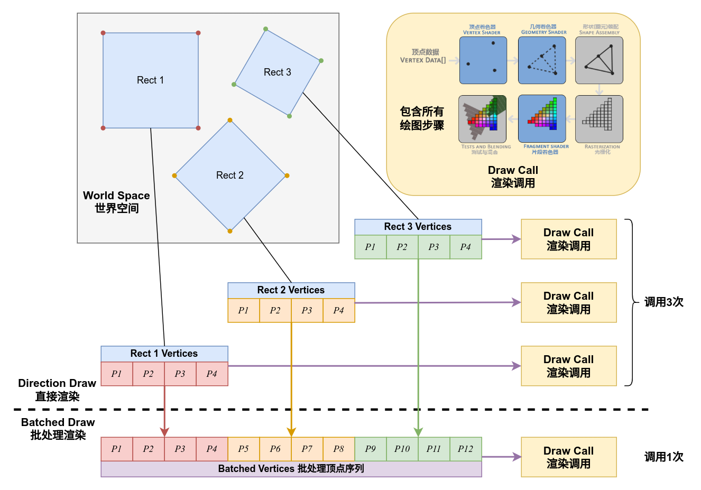

# Mindustry的渲染流程

> ***“在你凝视深渊时，深渊也在凝视你。”***

在教程前面的绘图与动画章节中，我们有提到过用`Draw` `Fill`之类的绘制工具类型来进行绘图的方式，回忆一下，使用这些工具类型时我们实际画出来的图案，它们大多是简单图形的组合，比如矩形、圆形、多边形等。

Mindustry的图形后台是OpenGL，那么也就是说使用那些工具绘制出来的图像，本质上也是在我们先前的几节中所讨论的那些绘图方法，只是将那些东西封装起来了而已。

但是Mindustry的绘图流程其实为游戏的渲染方式做了优化，从而和我们先前讲到的知识有所差异，本节会相当长，建议耐心看完。

## 批处理渲染（Batch）

我们先前讲过如何将图片画到屏幕上，到目前为止我们还只是一次只向屏幕上渲染一个正方形。

在数量少的时候可能还不容易察觉到，但是当我们绘制的场景变得更加复杂，需要绘制成千上万个正方形时，这样大量的渲染调用都会从`顶点提交`到`光栅化`到`像素着色`再到`混合`完整的进行一遍，在**只是绘制简单的图形时**这会带来大量的浪费。 

恰恰Mindustry的渲染中占比最大的就是这样**只有四个顶点的四边形**。

那么有什么办法改善这个问题呢？我们要解决的问题其实就是如何在一次渲染中尽可能多的绘制图形，来降低渲染调用的次数。

解决这个问题的办法就是将绘制方式相同（比如纹理相同，着色器程序相同等）的图形绘制工作整合起来，最终向OpenGL提供所有这些被整合的图形的顶点序列，这时就能够将多个方块的绘制工作在一次渲染中完成。



在Arc中批处理渲染被包装为类型`arc.graphic.g2d.Batch`及其子类实现，该类型的作用就是管理大量输入的四边形绘制，并将它们整合为一个批次完成渲染。

Mindustry内部的渲染几乎完全依赖于批处理渲染，在`arc.Core`中保存了一个静态单例`Core.batch`存储游戏绘图工具使用的共享批处理渲染对象，这个对象究其核心方法即以下几个`draw`方法重载：

```java Batch.java
public abstract class Batch{
  //...
  
  protected abstract void draw(Texture texture, float[] spriteVertices, int offset, int count);
  protected abstract void draw(TextureRegion region, float x, float y, float originX, float originY, float width, float height, float rotation);
  protected void draw(Runnable request){
    request.run();
  }
  
  //...
}
```

三个`draw`方法重载分别对应了三种绘制方式：

- 给定一个纹理，并手动传入顶点序列进行绘制
- 给定一张纹理区域，将其绘制为一个给定长宽与旋转角度的矩形
- 给定一个绘制请求，在非**排序模式**下直接执行绘制请求

> 排序模式后面会谈到

注意，这些方法被修饰为了`protected`，它们不是在我们绘图过程中直接使用的API，而是由`arc.graphics.g2d.Draw`类中的工具方法进行调用。

例如我们最常用的`Draw.rect`绘制四边形图像的方法，跟随参数转移重载，它最基本的定义是这样的：

```java Draw.java
//...

public static void rect(TextureRegion region, float x, float y, float w, float h, float originX, float originY, float rotation){
    Core.batch.draw(region, x - w /2f, y - h /2f, originX, originY, w, h, rotation);
}

//...
```

这调用的就是`Batch`的矩形绘制方法，而另一个常用的例子`Fill.quad`绘制任意四边形的方法，它的定义是这样的：

```java Fill.java
public static void quad(float x1, float y1, float c1, float x2, float y2, float c2, float x3, float y3, float c3, float x4, float y4, float c4){
    TextureRegion region = atlas.white();
    float mcolor = Core.batch.getPackedMixColor();
    float u = region.u;
    float v = region.v;
    vertices[0] = x1;
    vertices[1] = y1;
    vertices[2] = c1;
    vertices[3] = u;
    vertices[4] = v;
    vertices[5] = mcolor;

    vertices[6] = x2;
    vertices[7] = y2;
    vertices[8] = c2;
    vertices[9] = u;
    vertices[10] = v;
    vertices[11] = mcolor;

    vertices[12] = x3;
    vertices[13] = y3;
    vertices[14] = c3;
    vertices[15] = u;
    vertices[16] = v;
    vertices[17] = mcolor;

    vertices[18] = x4;
    vertices[19] = y4;
    vertices[20] = c4;
    vertices[21] = u;
    vertices[22] = v;
    vertices[23] = mcolor;

    Draw.vert(region.texture, vertices, 0, vertices.length);
}
```

其中的`Draw.vert`转向的是：

```java Draw.java
public static void vert(Texture texture, float[] vertices, int offset, int length){
    Core.batch.draw(texture, vertices, offset, length);
}
```

也就是调用的`Batch`的任意顶点序列绘制方法，我们通过`Fill`来绘制任意四边形时，实际上只是**构造包含这个四边形四个顶点信息的顶点序列，并将它提交给`Batch`进行绘制**。

现在我们来梳理一下，`Draw`中的绝大部分绘图方法追溯其源头都是通过`rect`来向屏幕绘制正方形图像，而在`Fill`和`Lines`中的几乎所有绘图方法最终指向的都是`vert`方法来构造顶点序列进行自由图形绘制。

至此，我们得到了一个结论：**Mindustry中的几乎所有图形绘制任务最终都指向了批处理渲染对象**。

## SpriteBatch

`Batch`是一个抽象类，游戏在实际绘制过程中会使用为特定渲染目的实现的子类，而在游戏中最常用的，渲染世界和UI的批处理类型即为`arc.graphic.g2d.SpriteBatch`。

在`Batch`中将管理的批次绘制到屏幕上的方法为`Batch.flush()`，我们来看看在`SpriteBatch`中的实现，我们省略掉所有细节，只看最重要的部分：

```java SpriteBatch.java
public class Batch {
  //...
  
  protected void setupMatrices(){
    //将变换矩阵与投影矩阵叠加
    combinedMatrix.set(projectionMatrix).mul(transformMatrix);
    getShader().setUniformMatrix4("u_projTrans", combinedMatrix);
  }
}

public class SpriteBatch extends Batch {
  //...
  
  @Override
  public void flush(){
    //...
    getShader().bind();
    setupMatrices();
    
    blending.apply();

    lastTexture.bind();
    Mesh mesh = this.mesh;
    mesh.setVertices(vertices, 0, idx);
    //...
    mesh.render(getShader(), Gl.triangles, 0, count);
  }
  
  //...
}
```

回忆一下我们前面几节所讲的内容，我们绘图时的一般过程是什么样的？绑定着色器，应用uniform变量（将投影与变换矩阵叠加后传入着色器），绑定纹理，然后通过`Mesh.render`提交顶点执行渲染。

发现了么？批处理渲染将批次刷新到屏幕上的过程与我们此前讲过的过程是完全一致的，`Batch`仅仅是将每一次绘制增加到队列中，并在这样一次刷新中将管理的所有绘制顶点组成一个序列提交给`Mesh`然后发送到OpenGL进行渲染。

Mindustry定义的`Mesh`格式为：

```
{
  VertexAttribute.position,
  VertexAttribute.color,
  VertexAttribute.texCoords,
  VertexAttribute.mixColor
}
```

同时，`SpriteBatch`内定义了一个默认的`Shader`，外部也可更改Batch使用的着色器，但是顶点属性应保持一致。

我们来看看默认的着色器代码，对比一下我们之前所使用的着色器代码：

```glsl default.vert
attribute vec4 a_position;
attribute vec4 a_color;
attribute vec2 a_texCoord0;
attribute vec4 a_mix_color;

uniform mat4 u_projTrans;

varying vec4 v_color;
varying vec4 v_mix_color;
varying vec2 v_texCoords;

void main(){
   v_color = a_color;
   v_color.a = v_color.a * (255.0/254.0);
   v_mix_color = a_mix_color;
   v_mix_color.a *= (255.0/254.0);
   v_texCoords = a_texCoord0;
   gl_Position = u_projTrans * a_position;
}
```

```glsl default.frag
varying lowp vec4 v_color;
varying lowp vec4 v_mix_color;
varying highp vec2 v_texCoords;

uniform highp sampler2D u_texture;

void main(){
  vec4 c = texture2D(u_texture, v_texCoords);
  gl_FragColor = v_color * mix(c, vec4(v_mix_color.rgb, c.a), v_mix_color.a);
}
```

多么相似的结构，它引入的那个`a_mix_color`也仅仅只是增加了一个混合颜色的操作，而其他的部分和我们之前所讲的着色器逻辑几乎完全一致，唯一比较大的区别就是将投影矩阵和变换矩阵叠加后再传入！


## 精灵序列图（Sprite）


