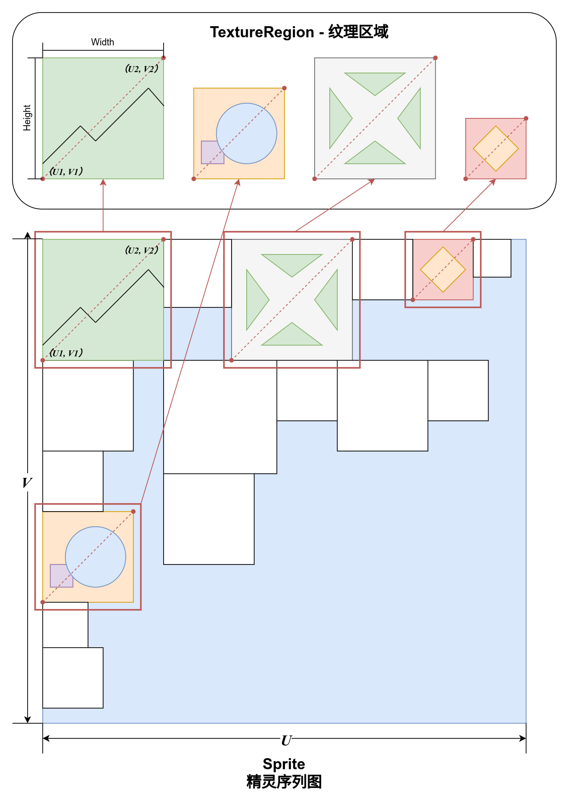
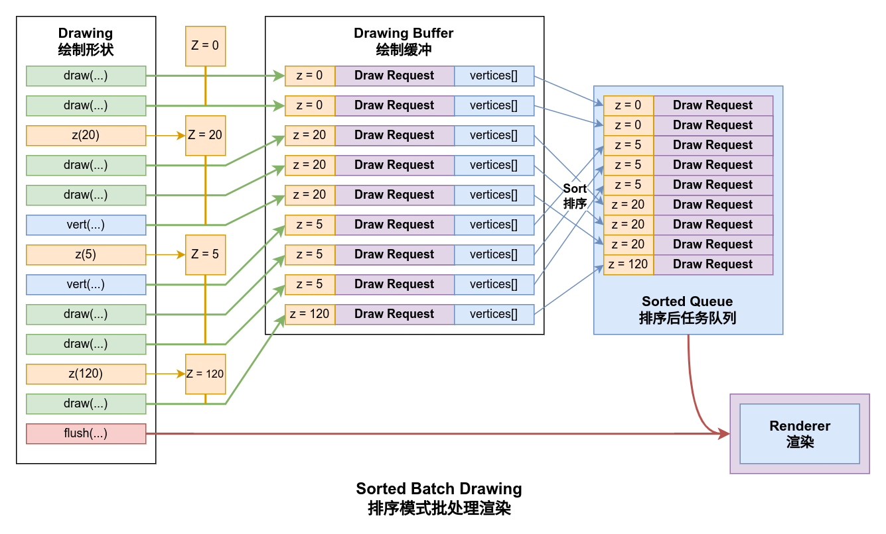

# Mindustry的渲染流程

> ***“在你凝视深渊时，深渊也在凝视你。”***

在教程前面的绘图与动画章节中，我们有提到过用`Draw` `Fill`之类的绘制工具类型来进行绘图的方式，回忆一下，使用这些工具类型时我们实际画出来的图案，它们大多是简单图形的组合，比如矩形、圆形、多边形等。

Mindustry的图形后台是OpenGL，那么也就是说使用那些工具绘制出来的图像，本质上也是在我们先前的几节中所讨论的那些绘图方法，只是将那些东西封装起来了而已。

但是Mindustry的绘图流程其实为游戏的渲染方式做了优化，从而和我们先前讲到的知识有所差异，本节会相当长，建议耐心看完。

## 批处理渲染（Batch）

我们先前讲过如何将图片画到屏幕上，到目前为止我们还只是一次只向屏幕上渲染一个正方形。

在数量少的时候可能还不容易察觉到，但是当我们绘制的场景变得更加复杂，需要绘制成千上万个正方形时，这样大量的渲染调用都会从`顶点提交`到`光栅化`到`像素着色`再到`混合`完整的进行一遍，在**只是绘制简单的图形时**这会带来大量的浪费。 

恰恰Mindustry的渲染中占比最大的就是这样**只有四个顶点的四边形**。

那么有什么办法改善这个问题呢？我们要解决的问题其实就是如何在一次渲染中尽可能多的绘制图形，来降低渲染调用的次数。

解决这个问题的办法就是将绘制方式相同（比如纹理相同，着色器程序相同等）的图形绘制工作整合起来，最终向OpenGL提供所有这些被整合的图形的顶点序列，这时就能够将多个方块的绘制工作在一次渲染中完成。


在Arc中批处理渲染被包装为类型`arc.graphic.g2d.Batch`及其子类实现，该类型的作用就是管理大量输入的四边形绘制，并将它们整合为一个批次完成渲染。

Mindustry内部的渲染几乎完全依赖于批处理渲染，在`arc.Core`中保存了一个静态单例`Core.batch`存储游戏绘图工具使用的共享批处理渲染对象，这个对象究其核心方法即以下几个`draw`方法重载：

```java Batch.java
public abstract class Batch{
  //...
  
  protected abstract void draw(Texture texture, float[] spriteVertices, int offset, int count);
  protected abstract void draw(TextureRegion region, float x, float y, float originX, float originY, float width, float height, float rotation);
  protected void draw(Runnable request){
    request.run();
  }
  
  //...
}
```

三个`draw`方法重载分别对应了三种绘制方式：

- 给定一个纹理，并手动传入顶点序列进行绘制
- 给定一张纹理区域，将其绘制为一个给定长宽与旋转角度的矩形
- 给定一个绘制请求，在非**排序模式**下直接执行绘制请求

> 排序模式后面会谈到

注意，这些方法被修饰为了`protected`，它们不是在我们绘图过程中直接使用的API，而是由`arc.graphics.g2d.Draw`类中的工具方法进行调用。

例如我们最常用的`Draw.rect`绘制四边形图像的方法，跟随参数转移重载，它最基本的定义是这样的：

```java Draw.java
//...

public static void rect(TextureRegion region, float x, float y, float w, float h, float originX, float originY, float rotation){
    Core.batch.draw(region, x - w /2f, y - h /2f, originX, originY, w, h, rotation);
}

//...
```

这调用的就是`Batch`的矩形绘制方法，而另一个常用的例子`Fill.quad`绘制任意四边形的方法，它的定义是这样的：

```java Fill.java
public static void quad(float x1, float y1, float c1, float x2, float y2, float c2, float x3, float y3, float c3, float x4, float y4, float c4){
    TextureRegion region = atlas.white();
    float mcolor = Core.batch.getPackedMixColor();
    float u = region.u;
    float v = region.v;
    vertices[0] = x1;
    vertices[1] = y1;
    vertices[2] = c1;
    vertices[3] = u;
    vertices[4] = v;
    vertices[5] = mcolor;

    vertices[6] = x2;
    vertices[7] = y2;
    vertices[8] = c2;
    vertices[9] = u;
    vertices[10] = v;
    vertices[11] = mcolor;

    vertices[12] = x3;
    vertices[13] = y3;
    vertices[14] = c3;
    vertices[15] = u;
    vertices[16] = v;
    vertices[17] = mcolor;

    vertices[18] = x4;
    vertices[19] = y4;
    vertices[20] = c4;
    vertices[21] = u;
    vertices[22] = v;
    vertices[23] = mcolor;

    Draw.vert(region.texture, vertices, 0, vertices.length);
}
```

其中的`Draw.vert`转向的是：

```java Draw.java
public static void vert(Texture texture, float[] vertices, int offset, int length){
    Core.batch.draw(texture, vertices, offset, length);
}
```

也就是调用的`Batch`的任意顶点序列绘制方法，我们通过`Fill`来绘制任意四边形时，实际上只是**构造包含这个四边形四个顶点信息的顶点序列，并将它提交给`Batch`进行绘制**。

现在我们来梳理一下，`Draw`中的绝大部分绘图方法追溯其源头都是通过`rect`来向屏幕绘制正方形图像，而在`Fill`和`Lines`中的几乎所有绘图方法最终指向的都是`vert`方法来构造顶点序列进行自由图形绘制。

至此，我们得到了一个结论：**Mindustry中的几乎所有图形绘制任务最终都指向了批处理渲染对象**。

## 缓冲与刷新

`Batch`的实际功能，实际上就是将其中的三个`draw`方法重载的绘制请求接管，其中绘制矩形和自定义顶点的两个方法会将传入的顶点存储到顶点缓冲区中，而绘制一个函数请求的方法则有具体实现来管理。

所有的顶点绘制都会被缓存起来，直到`Batch`的`flush()`方法调用时，批处理将会把缓存的顶点序列提交，然后重置缓冲区以开始下一次渲染。


现在，我们来复习一下在第五章中关于Batch刷新的知识点。

只要一次绘制中的重要参数和纹理不变，批次会正常的进行缓存直到手动调用`flush()`，而可能导致非手动批次刷新的情况大致有一下几种：

- **纹理切换**：绘制时使用了与上一个批次不同的纹理，则批次必须刷新以确保纹理被更新。 __*重要__
- **变换或投影矩阵更新**：在一次渲染中会接受投影与变换矩阵的叠加变换，当变换更新时需要刷新批次才能对后续的绘制生效。例如调用： `Draw.proj(projection)`或者`Draw.trans(transform)`
- **更换混合模式**：`Batch`中还维护着一个`Blending`的状态，这决定一个批次绘制时如何进行透明度混合，更新这个混合模式会导致批处理刷新，例如在通常混合模式下，调用`Draw.blend(Blending.additive)`
- **更换着色器**：当改变批处理使用的绘图着色器时，批次会需要刷新以应用新的着色器来绘制批次，例如调用`Draw.shader(shader)`，但是对于**排序模式**下的批处理会无法直接使用着色器，这个时候就会需要使用发送可运行绘图请求来完成自定义着色器的绘图。
- **超出批次最大限制**：缓冲的绘制请求过多，当一个任务超出一个批次的最大限制时，批次就会刷新以重置缓冲。

除去第一条和最后一条外，我们应当尽量少的去使用那些会导致批处理刷新的行为，以优化程序的运行效率。

而关于纹理切换这一点相当重要，在解释这一点之前，我们先解释`Batch`实际上如何绘图。

## SpriteBatch

`Batch`是一个抽象类，游戏在实际绘制过程中会使用为特定渲染目的实现的子类，而在游戏中最常用的，渲染世界和UI的批处理类型即为`arc.graphic.g2d.SpriteBatch`。

我们来看看在`SpriteBatch`中的`flush()`方法实现，我们省略掉所有细节，只看最重要的部分：

```java SpriteBatch.java
public class Batch {
  //...
  
  protected void setupMatrices(){
    //将变换矩阵与投影矩阵叠加
    combinedMatrix.set(projectionMatrix).mul(transformMatrix);
    getShader().setUniformMatrix4("u_projTrans", combinedMatrix);
  }
}

public class SpriteBatch extends Batch {
  //...
  
  @Override
  public void flush(){
    //...
    getShader().bind();
    setupMatrices();
    
    blending.apply();

    lastTexture.bind();
    Mesh mesh = this.mesh;
    mesh.setVertices(vertices, 0, idx);
    //...
    mesh.render(getShader(), Gl.triangles, 0, count);
  }
  
  //...
}
```

回忆一下我们前面几节所讲的内容，我们绘图时的一般过程是什么样的？绑定着色器，应用uniform变量（将投影与变换矩阵叠加后传入着色器），绑定纹理，然后通过`Mesh.render`提交顶点执行渲染。

发现了么？批处理渲染将批次刷新到屏幕上的过程与我们此前讲过的过程是完全一致的，`Batch`仅仅是将每一次绘制增加到队列中，并在这样一次刷新中将管理的所有绘制顶点组成一个序列提交给`Mesh`然后发送到OpenGL进行渲染。

Mindustry定义的`Mesh`格式为：

```
{
  VertexAttribute.position,
  VertexAttribute.color,
  VertexAttribute.texCoords,
  VertexAttribute.mixColor
}
```

同时，`SpriteBatch`内定义了一个默认的`Shader`，外部也可更改Batch使用的着色器，但是顶点属性应保持一致。

我们来看看默认的着色器代码：

```glsl default.vert
attribute vec4 a_position;
attribute vec4 a_color;
attribute vec2 a_texCoord0;
attribute vec4 a_mix_color;

uniform mat4 u_projTrans;

varying vec4 v_color;
varying vec4 v_mix_color;
varying vec2 v_texCoords;

void main(){
   v_color = a_color;
   v_color.a = v_color.a * (255.0/254.0);
   v_mix_color = a_mix_color;
   v_mix_color.a *= (255.0/254.0);
   v_texCoords = a_texCoord0;
   gl_Position = u_projTrans * a_position;
}
```

```glsl default.frag
varying lowp vec4 v_color;
varying lowp vec4 v_mix_color;
varying highp vec2 v_texCoords;

uniform highp sampler2D u_texture;

void main(){
  vec4 c = texture2D(u_texture, v_texCoords);
  gl_FragColor = v_color * mix(c, vec4(v_mix_color.rgb, c.a), v_mix_color.a);
}
```

对比一下我们之前所使用的着色器代码，多么相似的结构，它引入的那个`a_mix_color`也仅仅只是增加了一个混合颜色的操作，而其他的部分和我们之前所讲的着色器逻辑几乎完全一致！唯一比较大的区别就是将投影矩阵和变换矩阵叠加后再传入到Uniform中。

## 精灵序列图（Sprite）与纹理区域（TextureRegion）

好，现在继续引入我们前面提及的纹理切换问题。

我们在游戏中实际上会经常绘制出各种不同的贴图，每一个方块，部件之类的贴图几乎都不相同，而批处理渲染在纹理发生切换时就会触发更新，为了性能安全我们必须解决这个问题。

而Mindustry解决这个问题的方案就是**精灵序列图（Sprite）**，你应该至少已经看到过不止一次`sprites`这个单词，你的模组存放贴图的目录就叫这个名字。

精灵序列图是一张巨大的纹理（Mindustry内通常为**4096x4096**），由加载程序进行生成，游戏内的所有贴图，以及来自你的mod的贴图都会被紧密的排列在这样一张纹理上。

接着你提供的贴图会生成一个**纹理区域（TextureRegion）**，它描述了贴图在纹理上的具体位置，以及贴图的大小，这样就可以通过纹理区域来获取贴图在纹理上的具体位置。



这个过程不需要十分了解，我们所使用的关键在于纹理区域，它在Arc中封装为一个类型`arc.graphic.g2d.TextureRegion`，其中标记了这个贴图所在的精灵序列图（`texture`），以及本贴图在序列图中的主对角线端点位置（`u1`, `v1`, `u2`, `v2`）和尺寸（`width`，`height`）。

继续看绘图的着色器，着色器中会从顶点接收变量`a_texCoord0`用于标记采样位置，那么结合精灵序列图和纹理区域，我们就可以通过纹理区域上标记的纹理坐标范围，来作为顶点的`texCoord`属性，从而将纹理的切换转换为顶点上的一个属性。

实际上`TextureRegion`在我们讲到其背后的原理之前大概就已经被广泛的使用了，从方块记录自身的贴图到各种图像元素，Mindustry中几乎所有的贴图都是`TextureRegion`。

因此我们事实上进行绘制时，向着色器提供的几乎都是同一张纹理，或者很多个绘制任务后才会发生纹理的切换，这样就很好的解决了频繁切换纹理而导致的批处理刷新问题，从而优化了渲染任务的性能。

另外，精灵序列图的打包过程我们尽管无需深入了解，但是有一个重要的特性，打包时工具会在`sprites`中搜寻子目录，对于如下几个目录会打包到其特定的精灵序列图中：

- `ui`：仅用于GUI的贴图文件
- `environment`：仅用于静态场景绘制的贴图文件，如地板和矿物贴图
- `rubble`：单位死亡和残骸的纹理
- `editor`: 仅用于编辑器界面的贴图文件

而任何其他路径下的图像都会被包装至主要精灵序列，由于精灵序列图容量**只有4096x4096**，当贴图超出限制后，工具会打包到下一个序列图，**往往这就已经足以造成一定的性能问题！**

这里也就解释了在先前的章节中，为什么我们要将贴图文件放入在`sprites`中正确的子目录下的原因，我们不应该浪费特定的序列容量，将仅用于某一目的的贴图放入对应的目录是很有必要的。

## 排序批次模式（Sorted Batch）

此前我们绘图的过程中，总是或多或少的使用过一个方法`Draw.z(layer)`，比如利用`Draw.z(n)`来调节绘图顺序，通过`Draw.z(Layers.bloom)`来应用发光效果等。对这个方法的意义可能并不清楚，但是总是使用到它。

事实上这是来自`SpriteBatch`的一个重要功能，这模拟了一个用于决定绘制请求先后顺序的`z`轴，更具体点说，它可以**调整绘制任务进行的优先级**。

我们下称这个为**虚拟z轴**，这个轴要生效需要启用了**排序批次模式**，即启用了`Draw.sort(true)`。

当启用虚拟z轴后，Batch除非手动执行`flush()`，否则任何操作都不会触发刷新，而是将所有的绘制任务都加入到待排序队列。

每一个绘制任务都会被分配一个虚拟`z`轴标记它的渲染时机，`z`来自当前通过`Draw.z(n)`设置的值。在执行批次刷新前，Batch会根据`z`值对绘制任务进行排序，然后按照顺序执行绘制任务。



我们前面提到过排序模式下，不能更改着色器，而我们应该采用的方案是在绘制任务中发布一个绘制任务，从而在此层级上应用这个着色器：

::: code-group

```java 
void example(){
  float layer = Draw.z();
  Draw.draw(layer, () -> {
    Draw.shader(myShader);
    Draw.rect(/*...*/);
  });
}
```

```kotlin
fun example() {
  val layer = Draw.z()
  Draw.draw(layer) {
    Draw.shader(myShader)
    Draw.rect(/*...*/)
  }
}
```

:::

或者，我们可以设置层级区间，来在区间开始时执行一个任务，在结束时执行另一个：

::: code-group

```java
void example(){
  Draw.drawRange(
      layer, 
      range,
      () -> {/*...*/},
      () -> {/*...*/}
  );
}
```

```kotlin
fun example() {
  Draw.drawRange(
    z = layer,
    range = range,
    beging = { /*...*/ },
    end = { /*...*/ }
  )
}
```

:::

而Mindustry的游戏中，主要的世界内渲染流程就是排序模式的，因此我们才可以在世界绘制的过程中使用虚拟z轴来进行层级排序。

Mindustry的主要渲染流程都被分解为了若干各层级或者层级范围上的绘图任务，可以在`mindustry.core.Renderer`中找到主要的渲染工作进行方式，而这些被标记的层级均在`mindustry.core.Layer`内找到常量值定义，这里不再多做论述。

## 小练习

试试将我们之前几节所写下的那个演示渲染插入到世界空间里，要怎么做呢？

::: details 小提示
###### 小提示：我们可能并不需要使用批处理来绘制我们的着色器？
:::
