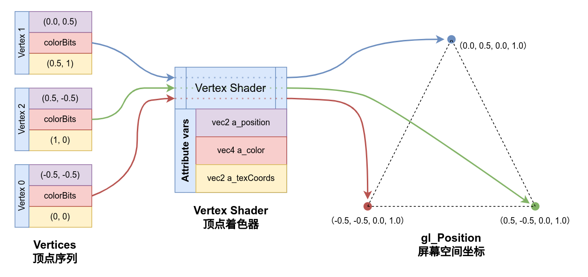
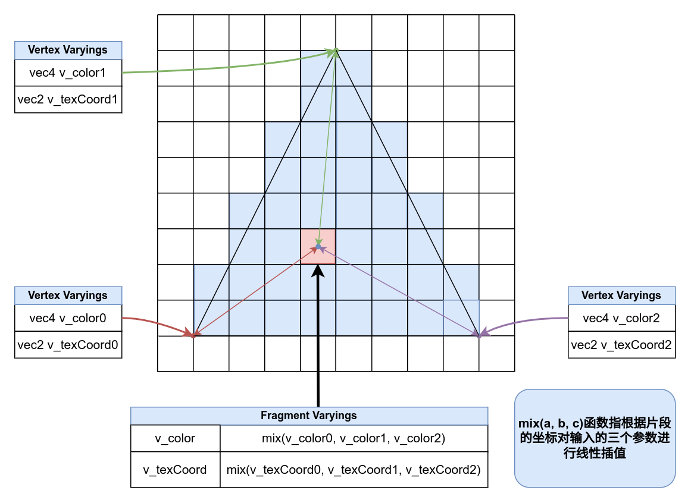
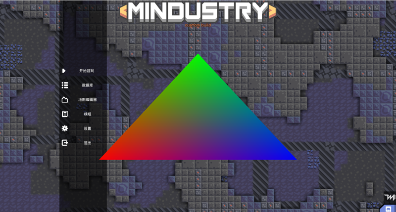
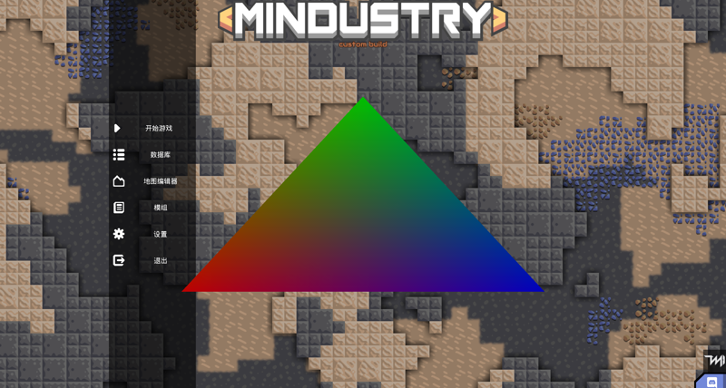
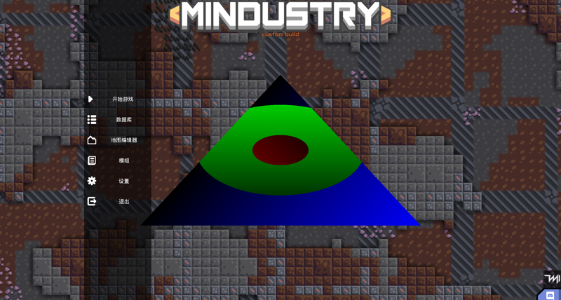
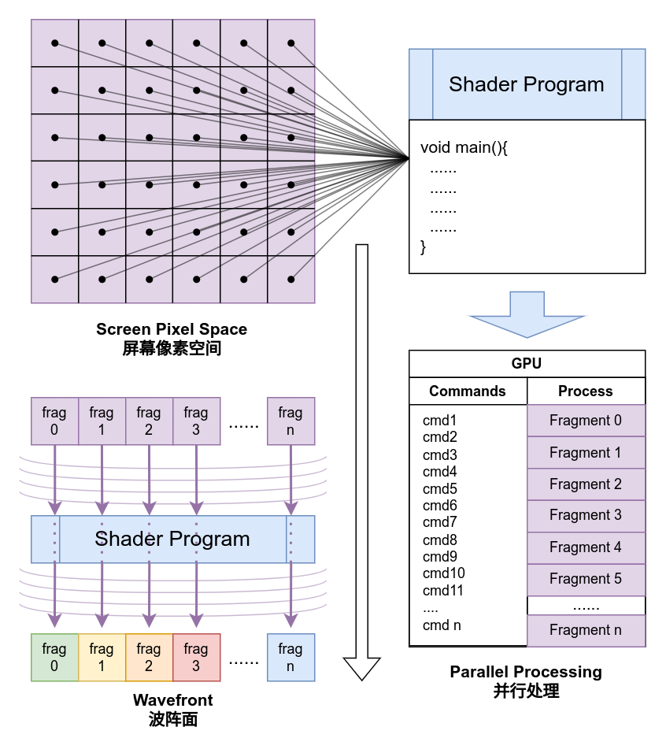

# 着色器（Shader）

> ***“计算机图形学的首要任务，就是将抽象的代码转化为屏幕上丰富多彩的图像。”***

> 终于讲到着色器了！我们上一节只是解释了OpenGL绘图的流程与方式，但是其中最关键的着色器还未进行说明。经过本篇的讲解，我们就正式可以向屏幕上绘制图形了！

Arc GL强制使用OpenGL可编程管线，我们绘图时会需要向GL提供一些程序来告知GL如何去处理顶点以及为像素上色，而这些程序就被称为**着色器（Shader）**。

在Arc GL中，着色器程序又分两种：**顶点着色器（Vertex Shader）**与**片段着色器（Fragment Shader）**，而它们都被包装在了一个类型`arc.graphic.gl.Shader`中，要创建一个着色器，只需要将着色器程序的内容作为参数传入到其构造函数即可：

::: code-group

```java
void example(){
  String vertexShader = "...";
  String fragmentShader = "...";
  
  Fi vertShaderFi = new Fi("...");
  Fi fragShaderFi = new Fi("...");
  
  Shader shaderWithSource = new Shader(vertexShader, fragmentShader);
  Shader shaderWithFile = new Shader(vertShaderFi, fragShaderFi);
}
```

```kotlin
fun example() {
  val vertexShader = "..."
  val fragmentShader = "..."
  
  val vertShaderFi = Fi("...")
  val fragShaderFi = Fi("...")

  val vertShader = Shader(vertexShader, fragmentShader)
  val fragShader = Shader(vertShaderFi, fragShaderFi)
}
```

:::

## glsl

在开始讲解着色器程序之前，我们需要先了解**GLSL**。GLSL是OpenGL着色语言（OpenGL Shading Language）的简称，编写着色器程序使用的就是GLSL编程语言。

> 这里有一些外部链接会讲解GLSL，尽管它们的平台可能有所差异，但是大多内容是互通的，而我们也会对GLSL的基本语法进行讲解：
> - **LearnOpenGL** https://learnopengl-cn.github.io/01%20Getting%20started/05%20Shaders/
> - **MDN** https://developer.mozilla.org/zh-CN/docs/Games/Techniques/3D_on_the_web/GLSL_Shaders
> - **知乎** https://zhuanlan.zhihu.com/p/349296191 
> - **简书** https://www.jianshu.com/p/5a2c4fff675e

GLSL是一种类似C的极简快速编程语言，它包含了宏，变量，函数，控制语句等基本语法，并添加了一些OpenGL的特性，例如向量，矩阵以及一些内置函数和内建变量。

### glsl数据类型

GLSL包含`float`、`int`、`bool`等基本数据类型，以及向量与矩阵类型，还包含了一类**采样器（Sampler）** 类型用于纹理采样，采样器在下节会详细介绍，本节我们先略过。

**向量类型**由`vec`开头，后随其向量维度：

| 类型      | 释义     |
|---------|--------|
| `vec2`  | 二维向量   |
| `vec3`  | 三维向量   |
| `vec4`  | 四维向量   |
| `ivec2` | 二维整数向量 |
| `ivec3` | 三维整数向量 |
| `ivec4` | 四维整数向量 |
| `bvec2` | 二维布尔向量 |
| `bvec3` | 三维布尔向量 |
| `bvec4` | 四维布尔向量 |

**矩阵类型**由`mat`开头，后随其矩阵的维度：

| 类型       | 释义     |
|----------|--------|
| `mat2`   | 二维矩阵   |
| `mat3`   | 三维矩阵   |
| `mat4`   | 四维矩阵   |
| `mat2x3` | 2行3列矩阵 |
| `mat2x4` | 2行4列矩阵 |
| `mat3x2` | 3行2列矩阵 |
| `mat3x4` | 3行4列矩阵 |
| `mat4x2` | 4行2列矩阵 |
| `mat4x3` | 4行3列矩阵 |

构造向量与矩阵有多种构造函数：

```glsl
vec3 a = vec3(1.0);           // (1.0, 1.0, 1.0)
vec3 b = vec3(1.0, 2.0, 3.0); // (1.0, 2.0, 3.0)
vec3 c = vec3(b);             // (1.0, 2.0, 3.0)
vec2 d = vec2(1.0, 2.0);      // (1.0, 2.0)
vec4 e = vec4(d, 1.0, 2.0);   // (1.0, 2.0, 1.0, 2.0)

mat3 m = mat3(
  1.0, 2.0, 3.0, // | 1.0, 4.0, 7.0 |
  4.0, 5.0, 6.0, // | 2.0, 5.0, 8.0 |
  7.0, 8.0, 9.0  // | 3.0, 6.0, 9.0 |
);

mat3 n = mat3(a, b, c); 
// | 1.0, 1.0, 1.0 |
// | 1.0, 2.0, 2.0 |
// | 1.0, 3.0, 3.0 |

mat3 o = mat3(m);
// | 1.0, 4.0, 7.0 |
// | 2.0, 5.0, 8.0 |
// | 3.0, 6.0, 9.0 |

mat3 p = mat3(1.0);
// | 1.0, 1.0, 1.0 |
// | 1.0, 1.0, 1.0 |
// | 1.0, 1.0, 1.0 |
```

而当我们需要访问某个或某几个向量分量，亦或者我们要访问矩阵的某个或某列时，可以像对数组一样使用`[]`进行索引访问，亦或者对向量还可以通过`.x|y|z|w`或`.r|g|b|a`的组合进行多个分量的访问：

```glsl
vec4 a = vec4(1.0, 2.0, 3.0, 4.0);
float b = a[0]; // 1.0
float b = a[2]; // 3.0
float c = a.x;  // 1.0
float d = a.r;  // 1.0
vec2 e = a.xy;  // (1.0, 2.0)
vec2 f = a.gb;  // (2.0, 3.0)

mat3 m = mat3(
  1.0, 2.0, 3.0, // | 1.0, 4.0, 7.0 |
  4.0, 5.0, 6.0, // | 2.0, 5.0, 8.0 |
  7.0, 8.0, 9.0  // | 3.0, 6.0, 9.0 |
);
vec3 n = m[0];     // (1.0, 2.0, 3.0) - 第一列
vec3 o = m[2];     // (7.0, 8.0, 9.0) - 第三列
float p = m[0][1]; // 2.0 - 第一列第二行
float q = m[2].x;  // 7.0 - 第三列第一行
vec2 r = m[1].xy;  // (4.0, 5.0) - 第二列前两个元素
```

向量与向量，向量与矩阵和矩阵与矩阵均可以进行符合规则的数学运算，这部分属于线性代数的知识内容，如果对线性变换背后的数学原理感兴趣，可查阅相关资料，本篇我们只关注GLSL的语法。

> 向量与向量的`*`乘法与`/`除法是对分量逐个进行的，点乘法与叉乘法需要使用内置函数`dot(a, b)`与`cross(a, b)`。

运算范例：

```glsl
vec2 a = vec2(1.0, 2.0);
vec2 b = vec2(3.0, 4.0);
vec2 c = a + b; // c = vec2(4.0, 6.0)
vec2 c = a - b; // c = vec2(-2.0, -2.0)
vec2 d = a * b; // d = vec2(3.0, 8.0)
vec2 d = a / b; // d = vec2(1.0/3.0, 0.5)

mat2 m = mat2(
  2.0, 0.0,
  0.0, 2.0
);
mat2 n = mat2(
  0.0, 1.0,
  1.0, 0.0
);
mat2 o = m * n; 
// o = mat2(
//   0.0, 2.0,
//   2.0, 0.0
// )
vec2 t = a * m; // t = vec2(2.0, 4.0)
vec2 u = b * m; // u = vec2(6.0, 8.0)
```

我们编写glsl最重要的就是这些向量与矩阵的操作，而glsl的流程控制语句与C语言基本一致，包括`if`、`for`、`while`等，这里不再赘述。内建变量与内置函数在上方的外部链接中亦有详细介绍，后文中出现的一些内置函数与内建变量也会进行解释，这里不再多花篇幅。

## 顶点着色器（Vertex Shader）

顶点着色器负责在组装图元之前，处理输入的顶点数据，例如对绘制的顶点作变换，投影等操作，存储顶点着色器程序的文件一般后缀名被确定为`.vert`。

还记得在上一节出现的那张OpenGL渲染管线图吗？


顶点数据在输入到OpenGL之后，首先就会被提交给顶点着色器去进行顶点处理，在顶点着色器中，通过`attribute`修饰符定义的变量用于接收顶点上描述的属性，而这些属性对应的，就是在上一节中Mesh里定义的顶点模型。

例如，我们需要将上一节中的那个三角形直接按顶点颜色绘制到屏幕上的话，它的顶点着色器如下所示：

```glsl example.vert
attribute vec2 a_position;
attribute vec4 a_color;
attribute vec2 a_texCoord0;

varying vec4 v_color;
varying vec2 v_texCoord;

void main(){
  v_color = a_color;
  v_texCoord = a_texCoord0;
  gl_Position = vec4(a_position, 0.0, 1.0);
}
```

> [!WARNING]
> 注意`a_texCoord0`带有0后缀，在`VertexAttribute`中定义的`texCoord`属性的签名带有编号0，应留意这个容易出错的地方。

观察上面的范例，除用于接收顶点属性的三个`attribute`变量外，顶点着色器还定义了两个`varying`变量，**varying**变量的作用是向片段着色器传递数据，这个数据会在光栅化时进行插值，我们后文会详细解释。

顶点着色器会对调用一次`Mesh.render`时提交的每一个顶点都各执行一次，接着顶点着色器内需要将这个顶点**实际**的**屏幕空间坐标**赋值给内建变量`gl_Position`。

`gl_Position`是一个`vec4`类型的内建变量，它是顶点着色器的必要输出变量，在上一节我们讲过顶点会需要通过图元装配和光栅化后才能转换为屏幕上的像素目标，而进行图元装配的过程，所使用的顶点坐标正是对一个顶点经过顶点着色器处理后输出的`gl_Position`，由于我们在进行二维的平面绘制，所以我们可以用`0.0`和`1.0`来填充`gl_Position`的`z`与`w`分量。



> 有关`z`与`w`分量，在光栅化的过程中其实只有x和y分量被用于完成屏幕像素选取，z分量为屏幕空间深度，而w则没有直观的几何意义，用于在投影变换中完成透视除法，我们会在之后3D渲染的章节中进行讲解。

为什么要强调**实际坐标**呢？因为在实际的绘制工作中，我们接收顶点后往往需要根据它的位置以及摄像机的位置来对顶点坐标进行一系列的变换，使得顶点被正确的转换到屏幕空间中，这在之后会有一个专门的章节来进行讲解，仅需要知道提交给`gl_Position`的坐标不一定是顶点定义的坐标，还可以是坐标经过处理和变换后的到的坐标即可。

> [!NOTE]
> 实际上，`attribute`和`varying`修饰符是OpenGL2.0的过时标准，在OpenGL3.0之后，我们使用`in`和`out`修饰符来定义输入与输出变量。然而考虑Arc GL的目标平台存在多种OpenGL版本，因此我们仍然使用OpenGL2.0的标准来编写着色器，对高版本的过时标准兼容性在`Shader`的预处理中会被替换为高版本的标准，在之后的片段着色器中同样如此。

## 片段着色器（Fragment Shader）

接下来是片段着色器，片段着色器负责处理光栅化后传入的每一个像素的颜色，片段着色器的程序文件后缀名一般为`.frag`，有了片段着色器与顶点着色器，我们就终于可以向屏幕上绘制图形了！

回顾上一节，光栅化是对经过顶点着色器处理后的顶点坐标组装图元，然后将抽象的图元转换为屏幕上的实际像素的过程，接下来，片段着色器将会在所有这些像素上都执行一次，以设置这个像素的颜色。

片段着色器同样通过`varying`定义变量来从顶点着色器接收数据，来自顶点着色器的`varying`变量会将数据传递到顶点着色器的同名`varying`变量中，与顶点着色器中不同，在片段着色器中这些变量是只读的。

那么这里就引入了一个问题，顶点着色器只会对每一个顶点执行一次，但片段着色器却需要对光栅化后的每一个像素都执行一次，那么顶点着色器中的`varying`变量是如何传递到片段着色器中的呢？

事实上，在光栅化时，OpenGL还会对顶点着色器输出的`varying`变量进行插值，具体来说，在构成一个图元的若干顶点之间，GL会根据这个像素距离其图元的几个顶点之间的距离，对这几个顶点上的`varying`变量进行插值，然后传递给片段着色器。



是不是听起来比较抽象？我们刚刚编写的顶点着色器不是将颜色信息存储到图元顶点上了么，只需要修改一下我们上一节中的范例，将三角形的三个角颜色变为不同的颜色：

::: code-group

```java
void example(){
  Mesh mesh = new Mesh(
      true,//isStatic
      3,   //maxVertices
      0,   //maxIndices
      VertexAttribute.position,
      VertexAttribute.color,
      VertexAttribute.texCoords
  );
  mesh.setVertices(new float[]{
      //顶点坐标      颜色                   纹理坐标
      -0.5f, -0.5f,  color.toFloatBits(),  0f,   0f,
       0.0f,  0.5f,  color.toFloatBits(),  0.5f, 1f,
       0.5f, -0.5f,  color.toFloatBits(),  1f,   0f
  });
  
  mesh.render(shader, Gl.triangles);
}
```

```kotlin
fun example(){
  val mesh = Mesh(
      isStatic = true,
      maxVertices = 3, 
      maxIndices = 0, 
      VertexAttribute.position,
      VertexAttribute.color,
      VertexAttribute.texCoords
  )
  mesh.setVertices(floatArrayOf(
      //顶点坐标      颜色                   纹理坐标
      -0.5f, -0.5f,  color.toFloatBits(),  0f,   0f,
       0.0f,  0.5f,  color.toFloatBits(),  0.5f, 1f,
       0.5f, -0.5f,  color.toFloatBits(),  1f,   0f
  ))

  mesh.render(shader, Gl.triangles)
}
```

:::

然后我们编写一个非常简单的片段着色器，将顶点着色器传递过来的颜色直接作为像素颜色：

```glsl example.frag
varying vec4 v_color;
varying vec2 v_texCoord;

void main(){
    gl_FragColor = v_color;
}
```

特别注意，顶点着色器的`varying`变量在片段着色器中必须有相同的定义，否则着色器将不能正常工作，这里接收的`v_texCoord`在本节暂无作用，但仍需传递。

> [!NOTE]
> `gl_FragColor`是片段着色器中用于设置像素颜色的内建变量，可认为是片段着色器的输出变量，变量类型为`vec4`，四个分量分别为rgba值。事实上，和`varying`一样，`gl_FragColor`也是OpenGL2.0的过时标准，在OpenGL3.0之后该内建变量被移除，改为使用`out`修饰符来定义输出变量。而Arc GL同样会兼容过时标准，在GL3.0之后预处理器会为gl_FragColor定义一个同名的`out`变量。

通常情况下我们为了维护性，会将着色器程序存储为程序文件，此处为演示方便，直接用上一部分的顶点着色器和这个片段着色器以字符串字面量的形式创建`Shader`对象，然后用它来绘制三角形：

::: code-group

```java Example.java
class Example {
  Shader shader = new Shader(
      //顶点着色器
      """
      attribute vec2 a_position;
      attribute vec4 a_color;
      attribute vec2 a_texCoord0;
      
      varying vec4 v_color;
      varying vec2 v_texCoord;
      
      void main(){
          v_color = a_color;
          v_texCoord = a_texCoord0;
          gl_Position = vec4(a_position, 0.0, 1.0);
      }
      """,
      //片段着色器
      """
      varying vec4 v_color;
      varying vec2 v_texCoord;
      
      void main(){
          gl_FragColor = v_color;
      }
      """
  );

  Mesh mesh = new Mesh(true, 3, 0,  
      VertexAttribute.position,
      VertexAttribute.color,
      VertexAttribute.texCoords
  );
  
  {
    mesh.setVertices(new float[]{
        //顶点坐标     颜色                        纹理坐标
        -0.5f, -0.5f, Color.red.toFloatBits(),   0f, 0f,
        0f,    0.5f,  Color.green.toFloatBits(), 0.5f, 1f,
        0.5f, -0.5f,  Color.blue.toFloatBits(),  1f, 0f
    });
  }

  void draw() {
    shader.bind();
    mesh.render(shader, Gl.triangles);
  }
}
```

```kotlin Example.kt
class Example {
  val shader = Shader(
      //顶点着色器
      """
      attribute vec2 a_position;
      attribute vec4 a_color;
      attribute vec2 a_texCoord0;
      
      varying vec4 v_color;
      varying vec2 v_texCoord;
      
      void main(){
          v_color = a_color;
          v_texCoord = a_texCoord0;
          gl_Position = vec4(a_position, 0.0, 1.0);
      }
      """,
      //片段着色器
      """
      varying vec4 v_color;
      varying vec2 v_texCoord;
      
      void main(){
          gl_FragColor = v_color;
      }
      """
  )

  val mesh = Mesh(true, 3, 0,  
      VertexAttribute.position,
      VertexAttribute.color,
      VertexAttribute.texCoords
  )
  
  init {
    mesh.setVertices(floatArrayOf(
        //顶点坐标     颜色                        纹理坐标
        -0.5f, -0.5f, Color.red.toFloatBits(),   0f,   0f,
        0f,    0.5f,  Color.green.toFloatBits(), 0.5f, 1f,
        0.5f, -0.5f,  Color.blue.toFloatBits(),  1f,   0f
    ))
  }

  fun draw() {
    shader.bind()
    mesh.render(shader, Gl.triangles)
  }
}
```

:::

OpenGL的直接绘制流程会需要我们配置OpenGl的诸多状态与窗口，并需要手动刷新屏幕，但是我们在Mindustry中编写图形程序直接在绘制流程中去渲染网格即可，无需考虑GL的底层细节。

现在我们直接在mod主类的`init()`方法中实例化这个对象，并添加对`EventType.Trigger.uiDrawEnd`的监听器，去调用这个对象的`draw()`：

::: code-group

```java ExampleMod.java
public class ExampleMod extends Mod {
  @Override
  public void init() {
    Example example = new Example();
    Events.run(EventType.Trigger.uiDrawEnd, example::draw);
  }
}
```

```kotlin ExampleMod.kt
class ExampleMod : Mod() {
  override fun init() {
    val example = Example()
    Events.run(EventType.Trigger.uiDrawEnd, example::draw)
  }
}
```

:::

启动游戏，如果你的程序正确，那么你应该在游戏的主界面看到这样一个三角形：



看懂了吗？顶点着色器向片段着色器传递的`v_color`在光栅化时被插值了！所以在三角形内部的像素颜色是三个顶点颜色的混合。

## Uniform变量

除了提交顶点以外，我们还有一种方式可以从CPU向GPU发送数据，也就是设置着色器的Uniform变量。

Uniform在着色器中通过`uniform`声明变量来进行接收：

```glsl example.frag
uniform vec4 u_color;

void main(){
    gl_FragColor = u_color;
}
```

在OpenGl中，Uniform是一个全局量，其可以在CPU上的任何时候进行修改，但是在着色器中它是只读的，顶点着色器与片段着色器在渲染时，所有渲染线程会共享Uniform值。

设置Uniform值的工作流`Shader`类已经替我们封装好了，通过`setUniform`的若干衍生重载方法，可以向Uniform区域中提交各类数据，注意，设置Uniform前需要绑定着色器，例如：

::: code-group

```java
void example(Shader shader){
  shader.bind();
  shader.setUniformi("u_texture", 0);                     //设置单个整数
  shader.setUniformf("u_origin", 1.0f, 0.0f, 0.0f, 1.0f); //设置一个四维向量
  shader.setUniformf("u_camPos", camera.pos);             //对向量的java类型封装
  shader.setUniformf("u_color", Color.red);               //对颜色的java类型封装
  shader.setUniformMatrix(mat3);                          //设置一个3x3矩阵
  shader.setUniformMatrix4(mat4.val);                     //输入数组设置一个4x4矩阵
}
```

```kotlin
fun example(shader: Shader){
  shader.bind()
  shader.setUniformi("u_texture", 0)                     //设置单个整数
  shader.setUniformf("u_origin", 1.0f, 0.0f, 0.0f, 1.0f) //设置一个四维向量
  shader.setUniformf("u_camPos", camera.pos)             //对向量的java类型封装
  shader.setUniformf("u_color", Color.red)               //对颜色的java类型封装
  shader.setUniformMatrix(mat3)                          //设置一个3x3矩阵
  shader.setUniformMatrix4(mat4.`val`)                     //输入数组设置一个4x4矩阵
}
```

:::

例如，我们修改上文范例的片段着色器，让它接收一个颜色与绘图颜色进行混合：

```glsl example.frag
varying vec4 v_color;
varying vec2 v_texCoord;

uniform vec4 u_color;

void main(){
    gl_FragColor = v_color * u_color;
}
```

然后，在`draw()`方法中，我们向这个Uniform变量提交一个颜色：

::: code-group

```java Example.java
void draw() {
  shader.bind();
  shader.setUniformf("u_color", Color.lightGray);
  mesh.render(shader, Gl.triangles);
}
```

```kotlin Example.kt
fun draw() {
  shader.bind()
  shader.setUniformf("u_color", Color.lightGray)
  mesh.render(shader, Gl.triangles)
}
```

:::

> 你也可以尝试将输入的颜色更改为其他的看看混合的结果



## 优化你的着色器！

你应该有听说过，着色器程序是运行在 **GPU（图形处理器）** 上的，而GPU的特点是具有大量的低性能（相对CPU而言）计算单元，具有强大的并行处理能力，我们前文提过，像素着色器会对每一个像素都各执行一次，这在GPU上实际上是分配给了每一个计算单元去并行的处理大量的片段。

但是，高并行能力的代价是什么呢？那就是GPU的计算单元**没有逻辑处理器**，这意味着GPU只能高效的去进行数值运算，但对于**条件分支**这样的控制语句GPU的计算效率极其低下；而循环语句则只能进行常量次循环，事实上它是在运行前将循环内容平展开了而已。

例如，我们将前文的范例做一点修改，把顶点坐标也通过**varying**传递给片段着色器，如下所示：

`顶点着色器`
```glsl example.vert
attribute vec2 a_position;
attribute vec4 a_color;
attribute vec2 a_texCoord0;

varying vec4 v_color;
varying vec2 v_position;
varying vec2 v_texCoord;

void main(){
    v_color = a_color;
    v_position = a_position;
    v_texCoord = a_texCoord0;
    gl_Position = vec4(a_position, 0.0, 1.0);
}
```

`片段着色器`
```glsl example.frag
const vec4 c1 = vec4(1.0, 0.0, 0.0, 1.0);
const vec4 c2 = vec4(0.0, 1.0, 0.0, 1.0);
const vec4 c3 = vec4(0.0, 0.0, 1.0, 1.0);

varying vec4 v_color;
varying vec2 v_position;
varying vec2 v_texCoord;

void main(){
    float len = length(v_position);
    if (len < 0.1f) {
        gl_FragColor = v_color*c1;
    } else if (len < 0.3f) {
        gl_FragColor = v_color*c2;
    } else {
        gl_FragColor = v_color*c3;
    }
}
```

这个着色器能够正常工作，它会把顶点着色器传递过来的颜色按照距屏幕中心的距离来选择颜色进行混合，然后重新运行范例：



然而，事实上这个着色器结结实实的把三个分支里的代码**都运行了一遍**，然后最后再根据条件去选择分支计算的颜色！分支语句没有节约任何成本，反而为单个片段增加了不必要的其余分支的计算量！

具体来说，在GPU开始运行片段着色器时，它会为每一个片段都分配一个线程去运行片段着色器程序，但是所有这些线程是共用程序及计数器的，也就是说，**所有线程都会执行相同的代码**，GPU会将分支语句都计算一遍，然后根据条件去选择分支的计算结果，因此控制语句是无法跳过分支的代码片段的。

这个概念在OpenGL中被称为**波阵面（Wavefront）**，它形象的描述了数据在GPU中的并行处理过程。



但是我们也会遇到很多无法避免的分支语句的需求，面对这类问题有一类有限的解决方案，即利用**阶跃函数**或**钳制函数**来完成可能在分支中对数值的选择操作。

阶跃函数即`step(a, b)`，它能够根据输入的参数比对大小，然后输出0或1，当a > b时会输出0.0，否则输出为1.0，对于可以转换为数值计算的分支需求，应尽可能采用`step`来简化分支。

## 小练习

我们现在已经可以将图像显示在屏幕上了，那么也是时候开始做一些有趣的事情了，思考一个问题，如果我们想让这个三角形在屏幕上平移一段距离，应该怎么做呢？如果要让它运动起来呢？开始尝试吧。

::: details 小提示
###### 顶点着色器能够操作顶点的实际绘制位置；你可以使用Uniform来输入平移坐标
:::
